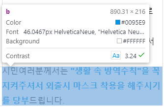
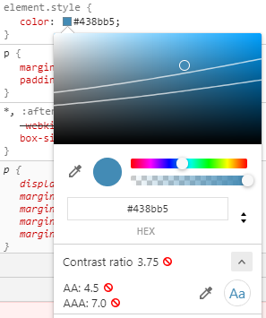

### a11y란?

>a11y는 대문자 혹은 소문자의 형태로도 표현되는데, 이것은 "Accessibility"라는 단어의    
>긴 철자를 글자수가 한정된 소셜 미디어에서 축약형으로 사용한 것에서 시작되었습니다.   
>A와 Y 사이의 11은, 컴퓨터공학이나 정보통신 기술 분야에서 긴 단어의 중간 글자들을 글자 대신 해당 철자들의 개수를 나타내는 숫자로 대체한 것에서 왔습니다.   
>즉, `accessibility`의 `A`와 `Y` 사이에는 11개의 글자가 있기 때문에 "a11y"가 된 것입니다.  
>다른 예를 하나 더 들자면, "l10N"은 "Localization"의 L과 N 사이의 10개의 글자를 숫자로 표기한 것입니다.

[출처: https://brunch.co.kr/@glassdice/81](https://brunch.co.kr/@glassdice/81 "출처")


### 셉템 접근성 지침 목차

---

1. 접근성 개요
   - [접근성이란](#basic)
   - [의미론적 HTML](#semantics)
2. MA
   - [모바일앱 접근성(MA)?](#mobile-basic)
   1. [인식의 용의성](#mobile-recognition)
   2. [운용의 용의성](#mobile-management)
   3. [이해의 용의성](#mobile-interests)
   4. [견고성](#mobile-firmness)
   5. [주요사용법](#mobile-directions)
3. WA
   - [웹 접근성(WA)?](#web-basic)
   1. [인식의 용의성](#web-recognition)
   2. [운용의 용의성](#web-management)
   3. [이해의 용의성](#web-interests)
   4. [견고성](#web-firmness)
   5. [주요사용법](#web-directions)
4. 참고사이트
   1. [W3C 접근성 원칙](https://www.w3.org/WAI/fundamentals/accessibility-principles/ko)
   2. [구글 개발자 접근성](https://developers.google.com/web/fundamentals/accessibility)
   3. [모질라 접근성](https://developer.mozilla.org/ko/docs/Learn/Accessibility/What_is_accessibilityl)
   4. [네이버접근성](https://accessibility.naver.com/accessibility)
   5. [네이버 널리 접근성 교육](https://nuli.navercorp.com/education)


<!-- 1. bla bla..
```css
.skipNav { position: absolute; top: -999px; }
.skipNav:focus { top: 0; }
```
2. bla bla..
3. bla bla.. -->

### 접근성이란? <a id="basic" href="#basic">#</a>
> 접근성이란 가능한 많은 사람들이 웹사이트를 사용할 수 있도록 하는 방법입니다.

- 모든 사람을 똑같이 대우하고, 동등한 기회를 주는 것입니다. 휠체어에 타고 있기 때문에 건물에 못 들어오게 하는 것이 잘못된 것이며 건물은 휠체어 경사로 또는 엘리베이터를 설치해  주어야합니다. 시각 장애가 있기 때문에 웹 사이트에서 누군가를 제외하는 것은 옳지 않습니다.

- 웹은 사람들의 하드웨어, 소프트웨어, 언어, 문화, 장소, 혹은 신체적 물리적 능력과 관계없이 모든 사람을 위해 작동하도록 설계되었습니다.
웹이 이 목표를 달성할 때, 다양한 범위의 청각, 움직임, 시각, 그리고 인지 능력을 가진 사람들이 웹에 접근할 수 있습니다.

접근성을 준수한 사이트를 구축하면
  - 의미론적 마크업(Semantic Markup)은 SEO를 개선하여 사이트를 더 쉽게 찾을 수 있습니다.
  - 접근성에 대한 배려는 좋은 윤리와 도덕을 보여 주며, 이는 공공의 이미지를 향상시킵니다.
  - 휴대 전화 사용자 또는 낮은 네트워크 속도와 같은 다른 그룹에서 사이트를 더 많이 사용할 수 있게 합니다.
  - 국가정보화기본법, 장애인차별금지법(장차법)등 법을 준수할 수 있습니다.

#### 장애 유형에 따른 접근성

##### 시각장애인
시각 장애가 있는 사람은 실명, 저시력자, 색각 이상(색맹, 색약)이 있는 자를 포함합니다.

- 시각 장애가 있는 많은 사람들은 물리적 돋보기 또는 소프트웨어 줌 기능인 화면 돋보기를 사용합니다. 요즘 대부분의 브라우저와 운영 체제에는 줌 기능이 있습니다. 일부 사용자는 디지털 텍스트를 소리 내어 읽는 소프트웨어인 화면 판독기에 의존합니다.

- 저시력자에 대응하기 위해 전경색과 배경색의 광도 간 관계인 색상과 대비를 맞출 필요가 있다. 색상이 서로 유사하면 명암비가 낮고 색상 차이가 크게 날수록 명암비가 높아진다. 모든 텍스트에 대해 AA(최소) 명암비인 4.5:1 이상이어야한다. 다만 폰트가 두껍거나 클 경우(14pt 이상 bold)와 매우 큰 텍스트(18pt 이상)의 경우 또는 텍스트 확대가 되는 경우 명암비를 3:1까지 낮출 수 있다.

- 콘텐츠에서 제공하는 모든 정보는 특정한 색을 구별할 수 없는 사용자, 흑백 디스플레이 사용자, 흑백 인쇄물을 보는 사용자 및 고대비 모드 사용자가 인식할 수 있도록 제공한다. 이 문제는   active, link, chart 같은 경우 빈번하게 발생한다. 이 경우 아이콘, 두께, 밑줄, 이미지 무늬 등의 차이를 추가로 제공한다.
  - PC 화면 낭독프로그램 : 윈도우 센스리더 최신버전 또는 죠스, NVDA 등 최신버전
  - 모바일 스크린리더 : iOS VoiceOver, Android Talk Back
  - 화면 확대, 반전, 고대비 기능 사용

##### 청각장애인
- 청각 장애가 있는 사람은 보조기기를 많이 사용하지 않습니다. 동영상 등의 오디오 콘텐츠에는 자막을 사용해야 하며, 청각장애인은 언어 발달 수준이 떨어지는 경우가 많기 때문에 텍스트의 단순화를 고려해야합니다.
  - 오디오 콘텐츠의 단순화된 자막 제공
##### 지체장애인
- 지체장애인은 손을 못 쓰는 사람일 수도 있으며, 마우스로 정확한 움직임을 사용할 수 있는 사람일 수도 있습니다. 그것은 외상이 아닌 노화의 결과일 수도 있고 하드웨어적인 문제로 인해 발생할 수도 있습니다.
  - 마우스를 사용하지 않고 키보드만 사용하여 사용 가능해야함
##### 인지장애인
- 인지 장애는 지적 장애인부터 고령까지 광범위한 장애를 말하며, 정신 질환을 가진 사람을 포함, 우울증, 정신 분열증 등 또한 난독증, 주의력 결핍 과잉행동장애(ADHD)와 같은 학습 장애가 있는 사람들을 포함합니다. 그들은 작업 완료 방법을 이해하고 이전에 수행했던 작업을 수행하는 방법을 기억하는데 어려움이 있습니다. 또한 혼란스러운 워크플로우 또는 일관성 없는 레이아웃/네비게이션/기타 페이지 기능에 대한 불만이 큽니다.
  - 페이지는 일관성이 있어야합니다. - 네비게이션, 헤더, 푸터 및 기본 콘텐츠는 항상 같은 위치에 있어야 합니다.
  - 잘 설계되어 사용하기 쉬워야합니다.
  - 다단계 프로세스는 논리적인 단계로 분류되며, 적절한 경우 프로세스를 얼마나 완료해야 하는지, 프로세스 완료까지 얼마나 남았는지 정기적으로 알려줍니다.
  - 워크플로우는 논리적이고 간단해야하며, 완료하는데 필요한 상호 작용 횟수가 최대한 적어야합니다. 예를 들어 회원가입하고 로그인하는 것은 종종 불필요하게 복잡합니다.
  - 한 페이지 안에 있는 정보는 지나치게 길거나 밀도가 높지 않아야 합니다.
  - 페이지에 사용되는 언어는 가능한 평범하고 알기 쉬우며 불필요한 전문 용어나 은어로 가득 차 있지 않아야 합니다.
  - 중요한 콘텐츠는 어떤 방법으로든 강조되어야 합니다.
  - 사용자 오류가 명확하게 강조 표시되며 해결 방법을 제안하는 도움말 메시지를 표시해야합니다.
  - 페이지는 일관성이 있어야합니다. - 네비게이션, 헤더, 푸터 및 기본 콘텐츠는 항상 같은 위치에 있어야 합니다.

이러한 기술은 "접근성 기술"이 아닙니다 - 그들은 좋은 설계 관행입니다. 사이트를 사용하는 모든 사람에게 혜택을 주며 작업의 표준 부분이 되어야 합니다.


#### 심사 장애 유형 및 특성

  <!-- | 장애유형 | 구분 | 환경 및 특성 | 비고 |
  | :---: | :---: | :---: | :---: |
  | 전맹 시각장애 | PC 웹 | PC화면 낭독프로그램 사용,키보드만 사용 | 본 가이드에서 정한 2가지 화면낭독기 중 중 하나이상 성공해야 인정 |
  |  | 모바일웹 | 모바일 스크린리더 사용,모든 손가락 사용 | Voiceover, Talkback 등으로 임의터치방식 진행 |
  | 저시력 시각장애 | PC 웹 | 확대 및 고대비 기능 사용,마우스, 키보드 사용 | 화면 확대, 반전, 고대비 등 사용 |
  |  | 모바일웹 | 확대 및 고대비 기능 사용,모든 손가락 사용 | 화면 확대, 반전, 고대비 등 사용 |
  | 지체(상지) 또는 뇌병변 장애 | PC 웹 | 키보드만 사용 | - |
  |  | 모바일웹 | 하나의 터치수단 사용(예: 한 손가락만 사용) | 터치방식으로 진행 또는 화면낭독기 환경에서 대체 수단 인정 | -->

  <table class="tb_type01">
    <caption>
      <strong>심사 장애 유형 및 특성</strong>
      <p>심사 장애 유형, 구분에 따른 환경 및 특성에 대하여 설명합니다.</p>
    </caption>
    <colgroup>
      <col style="width:20%;">
      <col style="width:12%;">
      <col style="width:25%;">
      <col style="width:auto;">
    </colgroup>
    <thead>
      <tr>
        <th scope="col">장애유형</th>
        <th scope="col">구분</th>
        <th scope="col">환경 및 특성</th>
        <th scope="col">비  고</th>
      </tr>
    </thead>
    <tbody>
      <tr>
        <th scope="row" rowspan="2">전맹 시각장애</th>
        <td>PC 웹</td>
        <td class="ta_left">PC화면 낭독프로그램 사용,키보드만 사용</td>
        <td class="ta_left">본 가이드에서 정한 2가지 화면낭독기 중 중 하나이상 성공해야 인정</td>
      </tr>
      <tr>
        <td>모바일웹</td>
        <td class="ta_left">모바일 스크린리더 사용,모든 손가락 사용</td>
        <td class="ta_left"> Voiceover, Talkback 등으로 임의터치방식 진행</td>
      </tr>
      <tr>
        <th scope="row" rowspan="2">저시력 시각장애</th>
        <td>PC 웹</td>
        <td class="ta_left">확대 및 고대비 기능 사용,마우스, 키보드 사용</td>
        <td class="ta_left">화면 확대, 반전, 고대비 등 사용</td>
      </tr>
      <tr>
        <td>모바일 웹</td>
        <td class="ta_left">확대 및 고대비 기능 사용,모든 손가락 사용</td>
        <td class="ta_left">화면 확대, 반전, 고대비 등 사용</td>
      </tr>
      <tr>
        <th scope="row" rowspan="2">지체(상지) 또는 뇌병변 장애</th>
        <td>PC 웹</td>
        <td class="ta_left">키보드만 사용</td>
        <td>-</td>
      </tr>
      <tr>
        <td>모바일웹</td>
        <td class="ta_left">하나의 터치수단 사용<br>(예: 한 손가락만 사용)</td>
        <td class="ta_left">터치방식으로 진행 또는 화면낭독기 환경에서 대체 수단 인정</td>
      </tr>
    </tbody>
  </table>

  #### 심사기관

  | 업체명 | |
  | :--: | :--: |
  | 한국웹접근성인증평가원 (사단법인 한국장애인단체총연합회) | http://www.wa.or.kr/index.asp |
  | 주식회사 웹와치 | http://www.webwatch.or.kr/ |
  | 사단법인 한국시각장애인연합회 (한국웹접근성평가센터) | http://www.kbuwel.or.kr/ |

```html
  <h1 class="foo">h1. Heading 1</h1>
  <h2>h2. Heading 2</h2>
  <h3>h3. Heading 3</h3>
  <h4>h4. Heading 4</h4>
  <h5>h5. Heading 5</h5>
  <h6>h6. Heading 6</h6>
  <ul role="tablist">
    <li role="presentation"><a href="javascript:;" role="tab" title="" aria-selected="false">현황</a></li>
    <li role="presentation"><a href="javascript:;" role="tab" class="on" title="" aria-selected="true">통계</a></li>
  </ul>
```


### 의미론적 HTML(semantic html) <a id="semantics" href="#semantics">#</a>
HTML은 원래 초기 인터넷 상의 문서를 설명하기 위한 마크업 언어로 만들어졌습니다. 인터넷이 성장하고 더 많은 사람들에 의해 채택되면서, 인터넷에 대한 요구는 바뀌었습니다.

인터넷이 원래 과학 문서를 공유하기 위한 것이었던 곳에서, 이제 사람들은 다른 것들도 공유하기를 원했다. 매우 빠르게, 사람들은 웹을 더 멋지게 만들고 싶어하기 시작했다.

웹은 처음에 설계하기 위해 만들어지지 않았기 때문에 프로그래머들은 다른 방식으로 배치하기 위해 다양한 해커를 사용했습니다. 프로그래머는 표를 사용하여 정보를 기술하기 위해 를 사용하는 것이 아니라 다른 요소를 페이지 상에 배치하기 위해 사용합니다.

시각적으로 디자인된 레이아웃의 사용이 진행됨에 따라 프로그래머들은 와 같은 일반적인 "의미적이지 않은" 태그를 사용하기 시작했습니다. 그들은 종종 그들의 목적을 설명하기 위해 이러한 요소들에 a 또는 속성을 부여한다. 예를 들어, 이 대신에
```html
<div>classid<div><div class="disp">
```
라고 써지는 경우가 많습니다.

#### 의미론적 HTML의 장점
- 1. 읽기가 훨씬 쉽다. 이것은 아마도 의미 요소를 사용하여 코드의 첫 번째 블록을 볼 때 가장 먼저 알아차릴 것입니다. 이것은 작은 예이지만 프로그래머로서 수백, 수천 줄의 코드를 
  읽을 수 있습니다. 코드를 읽고 이해하는 것이 쉬울수록 작업이 쉬워집니다.<br>
  전반적으로 의미적 요소들은 또한 보다 일관된 코드로 이어집니다. 의미적이지 않은 요소를 사용하여 헤더를 작성할 경우,
  ```html
  <div class="had"> <div id="had"> <div class="head"> <div>
  ```
  등 헤더 요소를 작성할 수 있는 방법은 매우 다양하며, 모두 프로그래머의 개인 취향에 따라 달라집니다. 표준적인 의미 요소를 작성함으로써 모든 사람이 쉽게 이해할 수 있습니다.

- 2. 비 의미성 코드보다 파일 크기가 가볍고 응답속도가 빠릅니다.

- 3. 접근성이 뛰어납니다. 의미 요소를 이해하기 쉬운 것은 당신뿐만이 아닙니다. 또, 검색 엔진이나 보조 테크놀로지(시력 장애가 있는 유저의 화면 리더등)는, 유저의 Web 사이트의   컨텍스트나 컨텐츠를 보다 잘 이해할 수 있기 때문에, 유저에게 있어서 보다 나은 체험을 제공할 수 있습니다.

- 4. SEO에 적합합니다. 검색 엔진은 제목, 링크 등에 포함된 키워드보다 제목, 링크 등에 포함된 키워드를 더 중요시하므로 고객이 문서를 더 쉽게 찾을 수 있습니다.

#### 의미론적 HTML의 요소
HTML5는 아직 비교적 새로운 것이기 때문에 의미적이지 않은 요소를 사용하는 것은 오늘날 웹사이트에서 여전히 매우 흔하다. HTML5에 추가된 의미 체계 요소는 다음과 같습니다.

[HTML5에 추가된 요소](https://www.freecodecamp.org/news/semantic-html5-elements/)
```html
<article>, <aside>, <details>, <figcaption>, <figure>, <footer>, <header>, <main>, <mark>, <nav>, <section>, <summary>, <time>
```
**[기타 기존에 있던 요소]**
```html
<head>, <title>, <body>, <header>, <footer>, <article>, <section>, <p>, <div>, <span>, , <aside>, <audio>, <canvas>, <datalist>, <details>, <embed>, <nav>, <output>, <progress>, <video>, <ul>, <ol>, <li>
```

#### 의미론적 HTML의 방법
의미론적인 마크업 - 통일되며, 명확합니다.

```html
<header></header>
<section>
	<article>
		<figure>
			
			<figcaption></figcaption>
		</figure>
	</article>
</section>
<footer></footer>
```
의미론적인 마크업 - 통일되며, 명확합니다.
```html
<div id="header"></div>
<div class="section">
	<div class="article">
		<div class="figure">
			
			<div class="figcaption"></div>
		</div>
	</div>
</div>
<div id="footer"></div>
```

<!-- | `<header>` |  |
| :-- | :-- |
| `<nav>` | |
| `<section>` | `<aside>` |
| `<article>` | |
| `<footer>` | | -->
<table>
  <tbody>
    <tr><td colspan="2">&lt;header&gt;</td></tr>
    <tr><td colspan="2">&lt;nav&gt;</td></tr>
    <tr><td>&lt;section&gt;</td><td rowspan="2">&lt;aside&gt;</td></tr>
    <tr><td>&lt;article&gt;</td></tr>
    <tr><td colspan="2">&lt;footer&gt;</td></tr>
  </tbody>
</table>

### 모바일 접근성(Mobile Accessibility)? <a id="mobile-basic" href="#mobile-basic">#</a>
>국가표준인 “모바일 애플리케이션 콘텐츠 접근성 지침 2.0“의 준수여부를 평가하는 전문가 심사와 장애유형별 사용자가 주어진 과업의 수행가능여부를 평가하는 사용자 심사를 수행, 두 심사의 평균 점수가 90점 이상인 경우 인증 마크 부여

#### 인증 대상
모바일 전화기, 태블릿기기 등 모바일 기기에서 실행되는 모든 애플리케이션 및 콘텐츠

<br>

#### 인증 유효기간
1년

<br>

#### 심사 기준
##### (KS X 3253) 모바일 애플리케이션 콘텐츠 접근성 지침 2.0<a href="../down/(KS X 3253) 모바일 애플리케이션 콘텐츠 접근성 지침 2.0.pdf" download >다운로드▼</a>

- 제개정일 : 2016-10-20
- 개정자 : [국립전파연구원](http://www.rra.go.kr)

<br>

#### 검사항목
| <center>4대원칙</center> | <center>검사항목 (24개)</center> | |
| :--- | :--- | :--- |
| 1. 인식의 용의성<br>(Perceivable) | 1.1 적절한 대체 텍스트 제공<br>1.2 자막, 수화 등의 제공<br>1.3 색에 무관한 콘텐츠 인식 | 1.4 명도 대비<br>1.5 명확한 지시 사항<br>1.5 알림 기능 |
| 2. 운용의 용의성<br>(Operable) | 2.1 초점 이동<br>2.2 누르기 동작 지원<br>2.3 응답시간 조절 | 1.1 적절한 대체 텍스트 제공<br>1.2 자막, 수화 등의 제공<br>1.3 색에 무관한 콘텐츠 인식 |
| 3. 이해의 용의성<br>(Understandable) | 3.1 입력 도움<br>3.2 사용자 인터페이스의 일관성<br>3.3 깜빡거림의 사용 제한 | 3.4 자동 재생 금지<br>3.5 예측 가능성 |
| 4. 견고성(Robust) | 4.1 폰트 관련 기능의 활용 | 1.1 적절한 대체 텍스트 제공<br>1.2 자막, 수화 등의 제공<br>1.3 색에 무관한 콘텐츠 인식 |

##### 사용자심사 보조기기(스크린리더) 기준
[Android talkback 사용법](https://support.google.com/accessibility/android/answer/6007100?hl=ko) / [iPhone VoiceOver 사용법](https://help.apple.com/iphone/9/?lang=ko#/iph3e2e2329)
| <center>구분</center> | <center>보조기기 (스크린리더)</center> | <center>비고</center> |
| :---: | :---: | :---: |
| 모바일 | i-OS VoiceOver, Android TalkBack 등의 최신버전 | 기기 및 OS는 가장 최적화 된 접근성<br> 환경을 제공하는 상태를 기준으로 함<br> 두 가지 모두 보조기기에서 과업 수행이 가능해야 함 |

##### 사용자심사 보조기기(스크린리더) 기준
| <center>단말</center> | <center>모바일 운영체제 및 브라우저</center> | <center>비고</center> |
| :--: | :--: | :--: |
| 최신iOS가 설치된 기기 | iOS 및 Safari(기본 브라우저) 최신 버전 | VoiceOver 사용 |
| 최신Android OS가 설치된 기기 | Android 및 Android(기본 브라우저) 최신 버전 | TalkBack 등의 최신 버전 |


### 1. 인식의 용의성 <a id="mobile-recognition" href="#mobile-recognition">#</a>

#### 1.1 대체 텍스트
(적절한 대체 텍스트 제공) 텍스트 아닌 콘텐츠는 그 의미나 용도를 인식할 수 있도록 대체 텍스트를 제공해야 한다.

- **링크** : title을 이용하여 대체 텍스트를 제공한다.
  ```html
  <a href="#" title="링크제목">링크제목</a>
  ```
- **이미지** : alt를 이용하여 대체 텍스트를 제공한다. 단순히 장식이나 시작적인 형태를 위해 사용되는 콘텐츠의 경우 대체 텍스트로 공백("")을 제공한다
  ```html
  
  ```
- **의미가 있는 배경 이미지** : 숨겨진 텍스트를 이미지 위에 얹어 대체 텍스트를 제공한다.
  display:none; 또는 visibility:hidden;는 스크린 리더가 읽을 수 없으므로 사용하면 안된다.
  width, height, font-size, line-height 등을 0으로 할 경우 스크린리더에서 콘텐츠를 무시한다. 사용금지.
  top위치는 페이지의 스크롤에 영향을 주므로, 스크롤이 이동하지 않도록 한다.
  ```html
  <div style="background:url('#');">
    <div class="blind">
      배경 이미지 설명
    </div>
  </div>
  ```
  ```css
  .blind {overflow:hidden;position:absolute !important;width:1px;height:1px;clip:rect(0 0 0 0);margin:-1px;color:transparent}
  ```

#### 1.2 자막, 수화 등의 제공
(자막, 수화 등의 제공) 영상이나 음성 콘텐츠에는 동등한 내용의 자막, 원고 또는 수화가 제공 되어야 한다.

1. 영상이나 음성 콘텐츠 내 제공되는 모든 음성정보는 동등한 내용의 자막, 원고, 수화 중 적어도 하나 이상을 제공해야 한다.
2. 영상이나 음성 콘텐츠에서 화면에 문자 정보가 의미를 가지고 있는 경우 이를 설명하는 별도의 음성 콘텐츠나 원고를 제공해야 한다.
3. 자막, 원고 또는 수화는 재생되고 있는 영상이나 음성 콘텐츠와 동기화하여 제공한다. 단, 실시간으로 제공되는 영상이나 음성 콘텐츠의 경우는 실시간 자막 또는 수화로 제공할 수 있다.
4. 음성이나 문자정보 없이 제공되는 영상이나 음성 콘텐츠는 이를 설명하는 화면해설을 제공하는 것이 바람직하다.

#### 1.3 색에 무관한 인식
(색에 무관한 인식) 화면에 표시되는 모든 정보는 색에 관계없이 인식될 수 있어야 한다.<br>
색에 의한 정보 표현을 방지하고 무늬로 정보를 제공한다. active메뉴, 차트나 그래프 등을 고대비 모드에서도 이용할 수 있도록 한다

#### 1.4 명도 대비
(명도 대비) 화면에 표시되는 모든 사용자 인터페이스 컴포넌트와 텍스트는 전경색과 배경색이 구분될 수 있도록 제공되어야 한다.<br>
화면에 표시되는 모든 사용자 인터페이스 컴포넌트와 텍스트는 전경색과 배경색이 구분될 수 있도록 명도 대비를 3：1 이상으로 제공해야 한다.
- [WebAIM 사이트](https://webaim.org/resources/contrastchecker/), [Contrast Finder](https://app.contrast-finder.org/?lang=ko)에서 색상 값으로 확인할 수 있다.
- 크롬 개발자도구에서 명도대비를 확인 할 수 있다. 다음 이미지 참조




#### 1.5 명확한 지시 사항
(명확한 지시 사항 제공) 지시 사항은 모양, 크기, 위치, 방향, 색, 소리 등에 관계없이 인식될 수 있어야 한다.<br>
시각장애인은 콘텐츠의 모양 이나 위치를 인지할 수 없기 때문에 동그란 버튼, 오른쪽 버튼 등으로 지칭하지 않는다.

#### 1.6 알림 기능
(알림 기능) 알림 정보는 화면 표시, 소리, 진동 등 다양한 방법으로 제공되어야 한다.

---
### 2. 운용의 용이성 <a id="mobile-management" href="#mobile-management">#</a>

#### 2.1 초점
(초점) 의미나 기능을 갖는 모든 사용자 인터페이스 컴포넌트에는 초점(focus)이 적용되고, 초점은 논리적인 순서로 이동되어야 한다.
1. 초점은 사용자가 예측할 수 있도록 논리적인 순서로 이동해야 한다.
2. 초점은 화면에서 보이지 않거나 논리적으로 의미를 갖지 않는 사용자 인터페이스 컴포넌트로 이동하지 않도록 해야 한다.
3. 표시되는 초점의 영역은 콘텐츠의 위치와 크기가 맞도록 제공해야 한다.

```css
*:focus {outline:1px solid blue}
```
##### 모바일 팝업의 초점 이동

##### 팝업 초점 이동 순서 [팝업 예시 새창보기](/a11y-ma-pop)
- ###### 팝업 초점 이동 순서
  팝업을 여는 버튼 → 팝업의 제목(a로 쌓여야함) → 팝업의 컨텐츠 → 팝업의 닫기 버튼 → 팝업을 여는(열었던) 버튼
  팝업이 열리는 버튼은 role="button" title="OO팝업열림"을 통해 알려준다.
  팝업의 첫번째 제목은 포커스가 갈 수 있도록 a를 준다.
  팝업이 열린 동안 팝업을 제외한 바닥페이지는 aria-hidden="true"를 주어 포커스가 가지 않도록 한다.
  팝업을 닫고 난 후 포커스는 팝업이 열리는 버튼으로 돌아가야한다.

##### 탭 초점 이동 순서 [탭 예시 새창보기](/a11y-ma-tab)

- ###### 탭 초점 이동 순서1
  탭 제목1 → 탭 컨텐츠1 → 탭 제목2 → 탭 제목3
  tabindex를 1부터 증가하게 사용하여 포커스의 순서를 맞춰준다.

- ###### 탭 초점 이동 순서2
  탭 제목1 → 탭 제목2… → 선택된 탭 컨텐츠
  탭 제목과 컨텐츠 사이에 거리가 있기 대문에 aria-aria-labelledby로 제목과 연동해준다.

  탭 제목의 목록은 role="tablist"를 포함한다.
  탭 제목 a는 role="tab"과 aria-selected="true/false"를 포함단다.
  탭 컨텐츠는 role="tabpanel"과 tabindex="0"을 포함하며, aria-labelledby="제목"으로 제목a와 엮어준다.<br>
  role="tabpanel"은 ui이에 사용할 수 없다.
  탭 제목과 컨텐츠간의 거리가 먼 경우 탭 제목에 aria-controls="컨텐츠아이디"를 삽입한다.
  ```html
  <ul class="tablist" role="tablist">
    <li><a href="#tab1" class="active" role="tab" aria-selected="true"><span>탭 제목1</span></a></li>
    <li><a href="#tab2" role="tab" aria-selected="false"><span>탭 제목2</span></a></li>
    <li><a href="#tab3" role="tab" aria-selected="false"><span>탭 제목3</span></a></li>
    <li><a href="#tab4" role="tab" aria-selected="false"><span>탭 제목4</span></a></li>
  </ul>
  <ul class="tabcon">
    <li id="tab1" tabindex="0" aria-labelledby="탭 제목1" role="tabpanel" style="display:block;">탭 제목1 콘텐츠</li>
    <li id="tab2" tabindex="0" aria-labelledby="탭 제목2" role="tabpanel" style="display:none">탭 제목22 콘텐츠</li>
    <li id="tab3" tabindex="0" aria-labelledby="탭 제목3" role="tabpanel" style="display:none">탭 제목333 콘텐츠</li>
    <li id="tab4" tabindex="0" aria-labelledby="탭 제목4" role="tabpanel" style="display:none">탭 제목4444 콘텐츠</li>
  </ul>
  ```

##### 팝업 포커스 스크립트

```javascript
$(function(){
	var tabM = $(".tablist a");
	var tabCont = $(".tabcon > li");
	tabM.click(function(){
		var tabIdx = $(this).parent("li").index();
		tabM.removeClass('active');
		tabM.attr('aria-selected','false');
		$(this).addClass('active');
		$(this).attr('aria-selected','true');
		tabCont.hide();
		tabCont.each(function () {
			tabCont.eq(tabIdx).show();
		});
	});
});
```
##### 스와이프 베너의 초점 이동
swiper.js

swiper js는 접근성 요소가 기본으로 포함되어 있다.
prev버튼과 next버튼으로 슬라이드를 제어할 수 있어야 하며, 이 버튼은 tabindex="0" role="button" aria-label="Next slide/Previous slide"를 포함해야 한다.
pagination에도 tabindex="0" role="button" aria-label="Go to slide 1"을 포함한다.

#### 누르기 동작 지원
(누르기 동작 지원) 터치(touch) 기반 모바일 기기의 모든 컨트롤은 누르기 동작으로 제어할 수 있어야 한다.
- 두 개 이상의 손가락을 동시에 이용해야 하는 다중 누르기(multi-touch) 동작, 팬(pan), 끌기와 놓기(drag and drop) 등의 복잡한 누르기 동작은 단순한 누르기 동작을 함께 제공해야 한다.

#### 2.3 응답 시간 조절
(누르기 동작 지원) 터치(touch) 기반 모바일 기기의 모든 컨트롤은 누르기 동작으로 제어할 수 있어야 한다.

- a 시간 제한이 있는 경우에는 제한 시간 연장 또는 이를 제어할 수 있는 수단을 함께 제공해야 한다.
- b 불가피한 사유(보안, 게임)로 a의 기능을 제공할 수 없는 경우에는 사용자에게 시간 제한이 있다는 것을 미리 알려주고, 종료되었을 경우에도 이를 알려주어야 한다.

#### 2.4 정지 기능 제공
(응답 시간 조절) 자동으로 변경되는 콘텐츠는 움직임을 제어할 수 있어야 한다.
- 이동하거나 스크롤 되는 콘텐츠 사용 배제 이동하거나 스크롤되는 콘텐츠 - 베너 등: 콘텐츠를 선택할 수 있는 컨트롤(예 : ‘앞으로 이동', ‘ 뒤로 이동’, ‘정지’ 등)을 제공해야 한다.

#### 2.5 컨트롤의 크기와 간격
(컨트롤의 크기와 간격) 컨트롤은 충분한 크기와 간격으로 제공되어야 한다.

1. 컨트롤 간에 외곽선을 표시하지 않는 경우 컨트롤 간의 중심 간 간격을 충분히 제공해야 한다.
2. 모바일 기기의 화면크기에 관계없이 컨트롤의 가로와 세로 크기는 각각 9 mm 이상으로 제공하는것이 바람직하다.

---
### 3. 이해의 용의성 <a id="mobile-interests" href="#mobile-interests">#</a>

#### 3.1 입력 도움
입력 서식 이용 시, 입력 오류를 방지하거나 정정할 수 있는 방법을 제공해야 한다. 입력 서식의 오류 내용을 수정하기 용이하도록 오류가 발생된 지점으로 초점을 이동시키는 것이 바람직하다.

- 입력 서식(`<input>`, `<textarea>`, `<select>` 요소 등)에 대응하는 레이블(`<label>` 요소, title 속성)을 제공해야 한다.
  ```html
  <input type="text" title="아이디">
  <input type="raido" checked="checked" name="vt_align" id="alignLft"><label for="alignLft">왼쪽정렬</label>
  <input type="checkbox" name="sports" id="soccer"> <label for="soccer">축구</label>
  <label><input type="checkbox" name="sports">축구</label>
  ```
#### 3.2 사용자 인터페이스의 일관성
사용자 인터페이스 컴포넌트들은 일관성 있게 배치되어야 한다.

#### 3.3 깜박거림의 사용 제한
(깜빡임과 번쩍임 사용 제한) 초당 3~50 회 주기로 깜빡이거나 번쩍이는 콘텐츠를 제공하지 않아야 한다.

#### 3.4 자동재생 금지
자동으로 재생되는 배경음은 제공하지 않아야 한다. 단, 3 초 미만의 배경음은 예외로 인정한다.
배경음을 사용할 경우, 사용자가 손쉽게 멈춤, 일시 정지, 음량조절 등과 같이 이를 제어할 수 있는 수단을 제공해야 한다.

#### 3.2 사용자 인터페이스의 일관성
(사용자 요구에 따른 실행) 사용자가 의도하지 않은 기능(새 창, 초점에 의한 맥락 변화 등)은 실행되지 않아야 한다.<br>
초점의 이동으로 기능이 실행되서는 안되며, 항상 버튼 활성화(클릭)으로만 실행되어야한다.<br>
새창의 링크(a)는 항상 target="blank" 속성을 가져야 한다.

---
### 4. 견고성 <a id="mobile-firmness" href="#mobile-firmness">#</a>
#### 4.1 폰트 관련 기능의 활용
(폰트 관련 기능의 활용) 텍스트 콘텐츠는 운영체제에서 제공하는 폰트 관련 기능을 활용할 수 있는 방법을 제공해야 한다.

1. 텍스트 콘텐츠는 폰트 크기의 조절이 가능하도록 제공되어야 한다.
2. 폰트 관련 기능을 활용할 수 있도록 범용폰트를 활용하는 것이 바람직하다.

#### 4.2 보조 기술과의 호환성
(보조 기술과의 호환성) 사용자 인터페이스 컴포넌트는 보조 기술을 이용하여 사용할 수 있도록 해야 한다.

1. 운영체제에서 제공하는 기본 사용자 인터페이스 컴포넌트를 최대한 이용하는 것이 바람직하다.
2. 부득이하게 기본 사용자 인터페이스 컴포넌트를 사용할 수 없을 시에는 운영체제에서 제공하는 보조 기술을 사용할 수 있도록 해야 한다.
3. 기본 컴포넌트를 원래의 기능과 다른 기능으로 제공할 경우 사용자가 컨트롤의 기능을 이해할 수 있도록 그 기능에 대한 정보를 제공해야 한다.

---

### 5. 주요 사용법 <a id="mobile-directions" href="#mobile-directions">#</a>

#### 5.1 role=''
aria 단독으로 사용될 경우 동작하지 않으므로 role 필요

- (역할정보) role="tab" , role="tablist" , aria-selected="boolean"
  ```html
  <ul role="tablist">
    <li role="presentation"><a href="javascript:;" role="tab" title="" aria-selected="false">현황</a></li>
    <li role="presentation"><a href="javascript:;" role="tab" class="on" title="" aria-selected="true">통계</a></li>
  </ul>
  ```
- (역할정보) role="button" , aria-pressed="boolean"
  ```html
  <a href="javascript:;" role="button" title="" aria-pressed="false">현황</a>
  ```
- (역할정보) role="radio/check" , aria-checked="boolean"
  ```html
  <a href="javascript:;" role="radio" title="" aria-checked="true">현황</a>
  <a href="javascript:;" role="radio" title="" aria-checked="false">현황</a>
  ```

#### 5.2 input checkbox/radio 접근성
input과 label이 중복되도록 읽지 않아야 하며 label에 포커스가 갔을 경우에도 input이 선택됨을 알 수 있어야한다.

1. input의 id와 lable의 for는 같은 이름으로 연결되어 있어야한다.

2. label에는 before,after을 제외한 요소가 없어야한다.
- 있을 경우 label에 포커스가 가게 되고 label에서 input 선택요소를 알 수 없다.
- label에 다른 요소가 필요한 경우 aira-hidden="true"로 포커스를 막아준다.
  ```html
  <input type="radio" name="rdo3" id="rdo31" checked="checked">
  <label for="rdo31" aria-hidden="true">
    <p class="loanTit">올원 직장인대출</p>
    <p class="loanAcc">123-456789-10-111</p>
    <div class="loanSubList">
      <span class="loanDay">만기일 : <em>2020.01.01</em></span>
      <span class="loanNum"><em>100,000,000</em>원</span>
    </div>
  </label>
  ```

#### 5.3 input 비밀번호 입력(마스킹 영역)

- 비밀번호와 같이 입력과 동시에 마스킹 처리되는 UI의 접근성 준수방법
  role="button", aria-label="비밀번호입력", (입력이 완료되면 title="4자리입력됨" 추가)
  ```html
  <div role="button" aria-label="계좌 비밀번호 입력" title="계좌 비밀번호 4자리 입력됨">
    <p>계좌비밀번호</p>
    <div class="icoPassword">
      <span class="on">비밀번호 1자리</span>
      <span class="on">비밀번호 2자리</span>
      <span>비밀번호 3자리</span>
      <span>비밀번호 4자리</span>
    </div>
  </div>
  ```
#### 5.4 input 비밀번호 입력(보안키패드)

- input="password"에 onclick 이벤트 걸 시 스크린리더로 동작을 안함 = 보안키패드 안열림.

  1. input 위에 투명한 버튼을 올리고 그 버튼에 onclick 이벤트로 보안키패드 열기
  2. input은 aria-hidden처리
  3. input에 값 입력되면 버튼에 title로 몇자리 입력됨 수정
  ```html
  <button type="button" class="btnTransparent" aria-label="계좌 비밀번호 입력" title="계좌 비밀번호 4자리 입력됨"></button>
  <input type="password" title="계좌 비밀번호 입력" maxlength="4" class="sKey" placeholder="숫자 4자리를 입력해 주세요" aria-hidden="true" readonly>
  <a href="javascript:" class="btnReset" role="button">입력내용삭제</a>
  ```

#### 5.5 체크박스를 체크시 팝업이 열리는 경우

1. a는 안에 있는 내용을 모두 읽기 때문에 a에 onclick을 넣으면 2번씩 읽는다. -> div에 onclick으로 처리
2. input checkbox에 title로 레이어 팝업 열림이라고 명시 필요
```html
<div href="javascript:;" class="link" onClick="alert('test');">
	<p class="txt department">
		<input type="checkbox" id="chk01" title="전체 유의사항 및 약관 동의 선택" name="chk" checked="checked" title="레이어 팝업 열림">
		<label for="chk01">
			<strong>의왕농협(주거래 지점)</strong>
			경기도 의왕시 사천1길 16
		</label>
	</p>
</div>
```

#### 5.6 focus 이동을 위한 tabindex 사용법
- focus를 받기 위해서는 마크업의 최하위 태그에 적용해야 함
  ```html
  <div>
    <div>
      <a href="javascript:;" tabindex="0">제목</a>
    </div>
  </div>
  ```
- (주의)감싸고 있는 영역에 tabindex 금지<br>
  태그 안으로 들어갈 수 없고, 임의탐색 불가
  ```html
  <div tabindex="0">
    <div>
      <a href="javascript:;">제목</a>
    </div>
  </div>
  ```

#### 5.7 chart 접근성
- (색에 무관한 콘텐츠 인식) 콘텐츠는 색에 관계없이 인식될 수 있어야 한다.<br>
  (적절한 대체 텍스트 제공) 대체텍스트 필요
  role="img", aria-label="그래프 내용 상세 서술" 을 활용하여 대체텍스트 제공
  ```html
  <div class="graphWrap" tabindex="0" role="img" aria-label="뷰티/미용 0%, 술/유흥 0%.......">
    그래프
  </div>
  ```

#### 5.8 달력 접근성
- 선택 되어 있는 날짜 : aria-selected="true" / 현재 날짜 : aria-current="date"<br>
  aria-current 사용법 이미지

#### 5.8 labal이 input과 겹치는 ui
- input을 숨기고 label에 디자인 되었거나, label이 input을 덮고 있는 경우,<br> 임의탐색 시 컨트롤에 접근되지 않아 input의 정보와 상태를 알 수 없음.<br>
  aria-label, rol, aria-hidden 활용하여 대응

  **id, for가 맞춰져 있으니, label태그 내 태그가 들어가면 매칭됨을 인지하지 못함 주의!**
  ```html
  <span role="checkbox" aria-checked="true" aria-label="(필수)NH모바일인증서 서비스 이용약관">
    <input type="checkbox" id="type01" checked aria-label="(필수)NH모바일인증서 서비스 이용약관" style="display:none">
    <label class="check" for="type01" aria-hidden="true"><em>(필수)</em> NH모바일인증서 서비스 이용약관</label>
  </span>
  ```
  ```html
  <input type="checkbox" id="type02" aria-label="(필수)개인정보 수집 및 이용 동의서">
  <label class="check" for="type02" aria-hidden="true"><em>(필수)</em> 개인정보 수집 및 이용 동의서</label>
  ```

---
### 웹 접근성(Web Accessibility)? <a id="web-basic" href="#web-basic">#</a>
>텍장애인, 고령자 등 정보접근약자가 웹 사이트 이용에 불편이 없도록 「국가정보화기본법」 제32조의2 및 동법 시행규칙 제3조의3에 의거 ‘국가표준 한국형 웹 콘텐츠 접근성 지침 2.1’을 준수한 웹사이트에 대해 웹 접근성 수준을 인정하고 이를 상징하는 웹 접근성 품질 마크를 부여하는 인증 제도

<br>

#### 인증 대상
인터넷을 통해 정보통신 서비스를 제공하는 웹사이트

<br>

#### 인증 유효기간
1년

<br>

#### 심사 기준

#### (KS X OT0003) 한국형 웹 콘텐츠 접근성 지침 2.1 <a href="../down/(KS X 3253) 모바일 애플리케이션 콘텐츠 접근성 지침 2.1.pdf" download >다운로드▼</a>
- 제개정일 : 2015-03-31
- 개정자 : [국립전파연구원](http://www.rra.go.kr)
※ 방송통신발전 기본법 제 33조 및 방송통신발전 기본법 시행령 제 30조에 의거하여 2015년 3월 31일 KWCAG 2.1 개정

<br>


#### 검사항목
(*)는 웹에만 있는 항목

<!-- | 4대원칙 | 검사항목 (24개) | |
| :--: | :--: | :--: |
| 1. 인식의 용의성<br>(Perceivable) | 1.1.1 적절한 대체 텍스트 제공<br>1.2.1 자막 제공<br>1.3.1 색에 무관한 콘텐츠 인식 <br>1.3.2 명확한 지시사항 제공 | 1.3.3 텍스트 콘텐츠의 명도 대비<br>1.3.4 자동재생 금지<br>1.3.5 콘텐츠 간의 구분|
| 2. 운용의 용의성<br>(Operable) | 2.1.1 키보드 사용 보장(PC웹)<br>2.1.1 누르기 동작 지원(모바일웹)<br>2.1.2 초점 이동<br>2.1.3 조작 가능<br>2.2.1 응답시간 조절 | 2.2.2 정지 기능 제공<br>2.3.1 깜빡임과 번쩍임 사용 제한<br>* 2.4.1 반복영역 건너뛰기<br>* 2.4.2 제목 제공<br>2.4.3 적절한 링크 텍스트 |
| 3. 이해의 용의성<br>(Understandable) | * 3.1.1 기본 언어 표시<br>3.2.1 사용자 요구에 따른 실행<br>3.3.1 콘텐츠의 선형화 | * 3.3.2 표의 구성<br>3.4.1 레이블 제공<br> 3.4.2 오류 정정|
| 4. 견고성(Robust) | 4.1.1 마크업 오류 방지 | 4.2.1 웹 애플리케이션 접근성 준수 | -->

<table>
  <thead>
    <tr>
      <th scope="col">4대원칙</th>
      <th scope="col" colspan="2">검사항목 (24개)</th>
    </tr>
  </thead>
  <tbody>
    <tr>
      <th scope="col">1. 인식의 용의성<br>(Perceivable)</th>
      <td>
        <ul class="noMargin">
          <li>1.1.1 적절한 대체 텍스트 제공</li>
          <li>1.2.1 자막 제공</li>
          <li>1.3.1 색에 무관한 콘텐츠 인식</li>
          <li>1.3.2 명확한 지시사항 제공</li>
        </ul>
      </td>
      <td>
        <ul class="noMargin">
          <li>1.3.3 텍스트 콘텐츠의 명도 대비</li>
          <li>1.3.4 자동재생 금지</li>
          <li>1.3.5 콘텐츠 간의 구분</li>
        </ul>
      </td>
    </tr>
    <tr>
      <th scope="col">2. 운용의 용의성<br>(Operable)</th>
      <td>
        <ul class="noMargin">
          <li>2.1.1 키보드 사용 보장(PC웹)</li>
          <li>2.1.1 누르기 동작 지원(모바일웹)</li>
          <li>2.1.2 초점 이동</li>
          <li>2.1.3 조작 가능</li>
          <li>2.2.1 응답시간 조절</li>
        </ul>
      </td>
      <td>
        <ul class="noMargin">
          <li>2.2.2 정지 기능 제공</li>
          <li>2.3.1 깜빡임과 번쩍임 사용 제한</li>
          <li><strong class="pointColor">* 2.4.1 반복영역 건너뛰기</strong></li>
          <li><strong class="pointColor">* 2.4.2 제목 제공</strong></li>
          <li>2.4.3 적절한 링크 텍스트</li>
        </ul>
      </td>
    </tr>
    <tr>
      <th scope="col">3. 이해의 용의성<br>(Understandable)</th>
      <td>
        <ul class="noMargin">
          <li><strong class="pointColor">* 3.1.1 기본 언어 표시</strong></li>
          <li>3.2.1 사용자 요구에 따른 실행</li>
          <li>3.3.1 콘텐츠의 선형화</li>
        </ul>
      </td>
      <td>
        <ul class="noMargin">
          <li><strong class="pointColor">* 3.3.2 표의 구성</strong></li>
          <li>3.4.1 레이블 제공</li>
          <li>3.4.2 오류 정정</li>
        </ul>
      </td>
    </tr>
    <tr>
      <th scope="col">4. 견고성 (Robust)</th>
      <td>
        <ul class="noMargin">
          <li>4.1.1 마크업 오류 방지</li>
        </ul>
      </td>
      <td>
        <ul class="noMargin">
          <li>4.2.1 웹 애플리케이션 접근성 준수</li>
        </ul>
      </td>
    </tr>
  </tbody>
</table>

#### 심사환경

##### 전문가심사 웹 브라우저 및 버전 기준

| <center>구분</center> | <center>웹 브라우저</center> | <center>비고 </center>|
| :--- | :--- | :--- |
| PC 웹 | IE(Internet Explorer) 최신 버전 |신청인이 특정 브라우저 버전을 제시하는 경우 하위버전으로 평가 가능(IE9버전 이상)|
| 모바일 웹 | 모바일 환경으로 <br>User Agent 변경 가능한 브라우저 최신버전 | User Agent 설정은 최신 OS 설치가 가능한 기기 |

##### 사용자심사 보조기기(스크린리더) 기준
[Android talkback 사용법](https://support.google.com/accessibility/android/answer/6007100?hl=ko) / [iPhone VoiceOver 사용법](https://help.apple.com/iphone/9/?lang=ko#/iph3e2e2329)

| <center>구분</center> | <center>보조기기 (스크린리더)</center> | <center>비고</center> |
| :--- | :--- | :--- |
| PC 웹 | 센스리더 최신버전 또는<br>죠스, NVDA 등 최신버전 |기기 및 OS는 가장 최적화 된 접근성 환경을 제공하는 상태를 기준으로 함<br>두 가지 중 하나 이상이 보조기기에서 과업 수행이 가능해야 함|
| 모바일 웹 | i-OS VoiceOver, Android TalkBack 등의 최신버전 | 기기 및 OS는 가장 최적화 된 접근성 환경을 제공하는 상태를 기준으로 함<br>두 가지 모두 보조기기에서 과업 수행이 가능해야 함 |

##### 사용자심사 모바일 단말 기준

| <center>단말</center> | <center>모바일 운영체제 및 브라우저</center> | <center>비고</center> |
| :--- | :--- | :--- |
| 최신iOS가 설치된 기기 | iOS 및 Safari(기본 브라우저) 최신 버전 | VoiceOver 사용|
| 최신Android OS가 설치된 기기 | Android 및 Android(기본 브라우저) 최신 버전 | TalkBack 등의 최신 버전 |

---
### 1. 인식의 용의성 <a id="web-recognition" href="#web-recognition">#</a>
#### 1.1 대체 텍스트
(적절한 대체 텍스트 제공) 텍스트 아닌 콘텐츠는 그 의미나 용도를 인식할 수 있도록 대체 텍스트를 제공해야 한다.

- 링크 : title을 이용하여 대체 텍스트를 제공한다.
  ```html
  <a href="#" title="링크제목">링크제목</a>
  ```

- 이미지 : alt를 이용하여 대체 텍스트를 제공한다. 단순히 장식이나 시작적인 형태를 위해 사용되는 콘텐츠의 경우 대체 텍스트로 공백("")을 제공한다
  ```html
  
  ```
- 의미가 있는 배경 이미지 : 숨겨진 텍스트를 이미지 위에 얹어 대체 텍스트를 제공한다.
  display:none; 또는 visibility:hidden;는 스크린 리더가 읽을 수 없으므로 사용하면 안된다.
  width, height, font-size, line-height 등을 0으로 할 경우 스크린리더에서 콘텐츠를 무시한다. 사용금지.
  top위치는 페이지의 스크롤에 영향을 주므로, 스크롤이 이동하지 않도록 한다.
  ```html
  <div style="background:url('#');">
    <div class="blind">
      배경 이미지 설명
    </div>
  </div>
  ```
  ```css
  .blind{overflow:hidden;position:absolute !important;width:1px;height:1px;clip:rect(0 0 0 0);margin:-1px;color:transparent}
  ```

#### 1.2 멀티미디어 대체 수단
- (적절한 대체 텍스트 제공) 텍스트 아닌 콘텐츠는 그 의미나 용도를 인식할 수 있도록 대체 텍스트를 제공해야 한다.

##### 1.2.1 자막 제공
- (자막 제공) 멀티미디어 콘텐츠에는 자막, 대본 또는 수화를 제공해야 한다.

#### 명료성

##### 1.3.1 색에 무관한 콘텐츠 인식
- (색에 무관한 콘텐츠 인식) 콘텐츠는 색에 관계없이 인식될 수 있어야 한다.
- 색에 의한 정보 표현을 방지하고 무늬로 정보를 제공한다. active메뉴, 차트나 그래프 등을 고대비 모드에서도 이용할 수 있도록 한다.

##### 1.3.2 명확한 지시 사항 제공

- (명확한 지시 사항 제공) 지시 사항은 모양, 크기, 위치, 방향, 색, 소리 등에 관계없이 인식될 수 있어야 한다.
- 시각장애인은 콘텐츠의 모양 이나 위치를 인지할 수 없기 때문에 동그란 버튼, 오른쪽 버튼 등으로 지칭하지 않는다.

##### 1.3.3 텍스트 콘텐츠의 명도대비
- (텍스트 콘텐츠의 명도대비) 텍스트 콘텐츠와 배경 간의 명도대비는 4.5 대 1 이상이어야 한다.
- 텍스트 콘텐츠를 구성하고 있는 텍스트 폰트를 18pt 이상 또는 14pt 이상의 굵은 폰트를 사용하는 경우에는<br> 명도 대비를 3대 1까지 낮출 수 있다.
- 화면 확대가 가능하도록 구현한 텍스트 콘텐츠(텍스트 및 텍스트 이미지)의 명도 대비는 3 대 1까지 낮출 수 있다.
  - [WebAIM 사이트](https://webaim.org/resources/contrastchecker/)에서 색상 값으로 확인할 수 있다.
  - 크롬 개발자도구에서 명도대비를 확인 할 수 있다.- 다음 이미지 참조

##### 1.3.4 자동 재생 금지

- (자동 재생 금지) 자동으로 소리가 재생되지 않아야 한다.<br>
  자동으로 재생될 경우 3초 내로 멈추며, 멈춤, 일시 정지, 음량 조절 등을 제공한다.

##### 1.3.4 자동 재생 금지
- (콘텐츠 간의 구분) 이웃한 콘텐츠는 구별될 수 있어야 한다.


---
### 2. 운용의 용이성 <a id="web-management" href="#web-management">#</a>

#### 2.1 입력장치 접근성  
<br>

##### 2.1.1 키보드 사용 보장
(키보드 사용 보장) 모든 기능은 키보드만으로도 사용할 수 있어야 한다.
- ###### 2.1.2 초점 이동 순서
- (초점 이동) 키보드에 의한 초점은 논리적으로 이동해야 하며, 시각적으로 구별할 수 있어야 한다.<br>
  - 초점 이동 순서 유지: 초천 이동 순서가 관례를 벗어나서는 안된다. 아이디, 비밀번호, 로그인 순서이어야 한다.
  - 함정 또는 오류 방지: 초점을 이동할 수 없거나 초점이 이전으로 돌아갈 수 없으면 안된다.
  - 초점의 시각화: 초점을 받은 부분 부분 주위에 점선이나 테두리로 표시한다.
    ```css
    *:focus {outline:1px solid blue}
    ```


##### 팝업 초점 이동 [PC 팝업 예시 새창보기](/a11y-wa-pop) / [모바일 팝업 예시 새창보기](/a11y-ma-pop)
- ###### 팝업 초점 이동 순서
  팝업을 여는 버튼 → 팝업의 제목(tabindex="0" 필수) → 팝업의 컨텐츠 → 팝업의 닫기 버튼 → 팝업을 여는(열었던) 버튼
  팝업이 열리는 버튼은 role="button"title="OO팝업열림"을 통해 알려준다.
  팝업의 첫번째 제목은 포커스가 갈 수 있도록 tabindex="0"를 준다.
  팝업이 열린 동안 팝업을 제외한 바닥페이지는 aria-hidden="true" 또는 tabindex="-1"을 주어 포커스가 가지 않도록 한다.
  팝업을 닫고 난 후 포커스는 원래 위치로 돌아가야한다.

<br>

##### 탭의 초점 이동 [탭 예시 새창보기](/a11y-ma-tab)

- ###### 탭 초점 이동 순서1
  탭 제목1 → 탭 컨텐츠1 → 탭 제목2 → 탭 제목3<br>
  tabindex를 1부터 증가하게 사용하여 포커스의 순서를 맞춰준다.
- ###### 탭 초점 이동 순서2
  탭 제목1 → 탭 제목2… → 선택된 탭 컨텐츠<br>
  탭 제목과 컨텐츠 사이에 거리가 있기 대문에 aria-aria-labelledby로 제목과 연동해준다.<br>
  탭 제목의 목록은 role="tablist"를 포함한다.<br>
  탭 제목 a는 role="tab"과 aria-selected="true/false"를 포함단다.<br>
  탭 컨텐츠는 role="tabpanel"과 tabindex="0"을 포함하며, aria-labelledby="제목"으로 제목a와 엮어준다.
  role="tabpanel"은 ui이에 사용할 수 없다.
  탭 제목과 컨텐츠간의 거리가 먼 경우 탭 제목에 aria-controls="컨텐츠아이디"를 삽입한다.
  ```html
  <ul class="tablist" role="tablist">
    <li><a href="#tab1" class="active" role="tab" aria-selected="true"><span>탭 제목1</span></a></li>
    <li><a href="#tab2" role="tab" aria-selected="false"><span>탭 제목2</span></a></li>
    <li><a href="#tab3" role="tab" aria-selected="false"><span>탭 제목3</span></a></li>
    <li><a href="#tab4" role="tab" aria-selected="false"><span>탭 제목4</span></a></li>
  </ul>
  <ul class="tabcon">
    <li id="tab1" tabindex="0" aria-labelledby="탭 제목1" role="tabpanel" style="display:block;">탭 제목1 콘텐츠</li>
    <li id="tab2" tabindex="0" aria-labelledby="탭 제목2" role="tabpanel" style="display:none">탭 제목22 콘텐츠</li>
    <li id="tab3" tabindex="0" aria-labelledby="탭 제목3" role="tabpanel" style="display:none">탭 제목333 콘텐츠</li>
    <li id="tab4" tabindex="0" aria-labelledby="탭 제목4" role="tabpanel" style="display:none">탭 제목4444 콘텐츠</li>
  </ul>
  ```

  <br>

##### 스와이프 베너의 초점 이동

**모바일 swiper.js**
- swiper js는 접근성 요소가 기본으로 포함되어 있다.
  prev버튼과 next버튼으로 슬라이드를 제어할 수 있어야 하며, 이 버튼은 tabindex="0" role="button" aria-label="Next slide/Previous slide"를 포함해야 한다.
  pagination에도 tabindex="0" role="button" aria-label="Go to slide 1"을 포함한다.
  커스터마이징에 따라 달라지기 때문에 상황에 따라 적용이 필요하다.

**PC bxslider.js**

<br>

##### 2.1.3 조작 가능

(조작 가능) 사용자 입력 및 컨트롤은 조작 가능하도록 제공되어야 한다.<br>
- **컨트롤의 크기** : 콘텐츠에 포함된 모든 컨트롤은 대각선 방향의 길이를 6.0 mm 이상으로 제공하는 것이 바람직하다.

#### 2.2 충분한 시간 제공
<br>

##### 2.2.1 응답 시간 조절
- **시간제한 콘텐츠 사용 배제** : 시간제한이 있는 콘텐츠는 제공하지 않아야 한다.
- **예외 콘텐츠** : 시간제한이 있더라도 온라인 경매, 실시간 게임 등과 같이 반응 시간의 조절이 원천적으로 허용되지 않는 경우에는 이 검사 항목이 적용되지 않는다. 다만 이 경우에도 사용자에게 시간제한이 있다는 것을 미리 알려주고, 종료되었을 경우에도 이를 알려주어야 한다. 세션 시간이 20 시간 이상인 콘텐츠의 경우에도 예외로 간주한다.
- **반응 시간 조절이 필요한 콘텐츠**: 반응 시간이 완료되기 전 시간제한 해제 또는 시간제한 연장을 할 수 있도록 해야한다. 또한 시간 조절 기능한 최소 20초 이상을 두고 사전에 알려주어야 한다.

##### 2.2.2 정지 기능 제공
자동으로 변경되는 콘텐츠는 움직임을 제어할 수 있어야 한다.<br>
- **이동하거나 스크롤 되는 콘텐츠 사용 배제 이동하거나 스크롤되는 콘텐츠 - 베너 등**: 콘텐츠를 선택할 수 있는 컨트롤(예 : ‘앞으로 이동', ‘ 뒤로 이동’, ‘정지’ 등)을 제공해야 한다.

<br>

#### 2.3 광과민성 발작
<br>

##### 2.3.1 깜빡임과 번쩍임 사용 제한
- (깜빡임과 번쩍임 사용 제한) 초당 3~50 회 주기로 깜빡이거나 번쩍이는 콘텐츠를 제공하지 않아야 한다.

<br>

#### 2.4 쉬운 내비게이션

<br>

##### 2.4.1 반복 영역 건너뛰기
- (반복 영역 건너뛰기) 콘텐츠의 반복되는 영역은 건너뛸 수 있어야 한다.
  ```html
  <div class="skip blind"><a href="#content">본문바로가기</a></div>
  ```
  ```css
  .blind{overflow:hidden;position:absolute !important;width:1px;height:1px;clip:rect(0 0 0 0);margin:-1px;color:transparent}
  .skip a:focus {position:static;width:auto;height:auto}
  ```
  "건너뛰기" 링크가 페이지의 첫 번째 링크 중 하나여야 한다.
  화면에서 숨겨져 있어도 상관 없으나 포커스는 화면 안에 존재해야 하고 스크린 리더가 읽을 수 있어야 한다.

##### 2.4.2 제목 제공
- (제목 제공) 페이지, 프레임, 콘텐츠 블록에는 적절한 제목을 제공해야 한다.
  ```html
  <title>@컨텐츠 제목 > @하위섹션명 : @서비스명</title>
  ```
  - **웹 페이지 제목 제공**<br>
    웹 사이트의 어느 페이지와도 다른 제목이어야 하며, 제목은 웹 페이지의 내용을 적절히 표현하며 간단하고 명료하게 제공

  - **프레임 제목 제공**<br>
    모든 웹 페이지의 프레임에는 각 프레임을 설명하는 간단명료한 제목을 제공 (예: 아무런 내용이 없는 프레임이라면 "내용 없음" 등으로 제목을 제공). "빈 프레임" 경우 스크린 리더에서 "프레임"을 두번 읽어주는 이슈로 사용하지 않음

  - **콘텐츠 블록 제목 제공**<br>
    `<h1>`, `<h2>` 요소 등을 부여하여 제목과 본문을 구분할 수 있도록 제공 (콘텐츠 블록 : 특정내용에 관해 설명하거나 기술하고 있는 정보의 묶음 혹은 영역)

##### 2.4.3 적절한 링크 텍스트
- (적절한 링크 텍스트) 링크 텍스트는 용도나 목적을 이해할 수 있도록 제공해야 한다.
  ```html
  <a href="#" title="메인페이지로 바로가기">
    
  </a>
  <a href="#" title="공지사항 더보기 페이지 이동">
    
  </a>
  ```
  ```html
  <!-- X -->
  <a href="#" role="button">...</a>

  <!-- O -->
  <button type="button">...</button>
  ```
  보조기기는 두 가지 예제를 모두 '버튼'으로 간주할 것입니다. 그러나 첫 번째 예제의 경우 브라우저는 문맥 메뉴를 통해 링크와 관련된 기능(새 탭에서 링크 열기, 링크 주소 복사 등)을 제공하게 되고 사용자를 혼란스럽게 합니다. 또한, 첫 번째 예제에서 '버튼'이라는 설명을 들은 보조기기 사용자는 '스페이스' 키를 눌러 버튼 기능을 사용하려고 시도할 수 있습니다. 하지만 a 요소는 '엔터' 키만으로 실행할 수 있습니다. button 요소는 '엔터' 키와 '스페이스' 키로 실행할 수 있기 때문에 a 요소로부터 '버튼'이라는 설명을 들은 보조기기 사용자를 혼란스럽게 합니다. 결국 올바른 HTML의 선택은 사용자 경험과 접근성 측면에서 모두 중요합니다.

---
### 3. 이해의 용의성 <a id="web-interests" href="#web-interests">#</a>
#### 3.1 기본 언어 표시
(기본 언어 표시) 주로 사용하는 언어를 명시해야 한다.
[HTML Language Code Reference](https://www.w3schools.com/tags/ref_language_codes.asp)
```html
<p lang="ko"></p>
<p lang="en"></p>
<p lang="zh"></p>
<p lang="ja"></p>
```
#### 3.2 예측 가능성
(사용자 요구에 따른 실행) 사용자가 의도하지 않은 기능(새 창, 초점에 의한 맥락 변화 등)은 실행되지 않아야 한다.<br>
초점의 이동으로 기능이 실행되서는 안되며, 항상 버튼 활성화(클릭)으로만 실행되어야한다.<br>
새창의 링크(a)는 항상 target="blank" 속성을 가져야 한다.


#### 3.3 콘텐츠의 논리성
- ##### 3.3.1 콘텐츠의 선형 구조
  - (콘텐츠의 선형 구조) 콘텐츠는 논리적인 순서로 제공해야 한다.<br>
  - 스타일과 관계 없이 논리적인 순서대로 콘텐츠를 읽을 수 있도록 마크업한다.<br>
  - "제목 > 내용 > 더보기" 순서를 권장하며, 더보기의 경우 명시적으로 어떠한 더보기인지 제공해야 한다.

- ##### 3.3.1 콘텐츠의 선형 구조
  - (표의 구성) 표는 이해하기 쉽게 구성해야 한다.
  - `<table>`은 `<caption>`, `<thead>`, `<tfoot>`, `<tbody>`, `<th>` 요소등 의미있는 마크업을 사용해야 한다.
  - `<caption>`은 반드시 제공해야만 하며, th의 내용을 포함하여 제목과 요약을 작성한다.
  - HTML5에서는 table에 "align", "bgcolor", "border", "cellpadding", "cellspacing", "frameX", "rules", "summary", "width" 속성들을 더이상 지원하지 않기 때문에 summary를 사용하지 않는다.
  - scope="col", scope="row"를 사용하여 스크린리더가 읽는 순서를 지정해준다.


<!-- | 구분 | 상품종류 |||
| :--: | :--: | :--: | :--: |

| | 스마트폰 | 태블릿PC | 데스크탑PC |
| :--: | :--: | :--: | :--: |
| 1월 | 5만대 | 3만대 | 1만대 |
| 2월 | 7만대 | 2만대 | 1만대 |
| 계 | 12만대 | 5만대 | 2만대 | -->
<table>
  <!-- <caption>구분, 상품종류, 1월, 2월, 계을(를) 포함한 상품에 따른 월별 판매현황</caption> -->
  <thead>
    <tr>
      <th rowspan="2" scope="col">구분</th>
      <th colspan="3" scope="colgroup">상품종류</th>
    </tr>
    <tr>
      <th scope="col">스마트폰</th>
      <th scope="col">태블릿PC</th>
      <th scope="col">데스크탑PC</th>
    </tr>
  </thead>
  <tbody>
    <tr>
      <th scope="row">1월</th>
      <td>5만대</td>
      <td>3만대</td>
      <td>1만대</td>
    </tr>
    <tr>
      <th scope="row">2월</th>
      <td>7만대</td>
      <td>2만대</td>
      <td>1만대</td>
    </tr>
  </tbody>
  <tfoot>
    <th scope="row">계</th>
    <td>12만대</td>
    <td>5만대</td>
    <td>2만대</td>
  </tfoot>
</table>

```html
<h1>상품에 따른 월별 판매현황</h1>
<table>
	<caption>구분, 상품종류을(를) 포함한 상품에 따른 월별 판매현황</caption>
	<thead>
		<tr>
			<th rowspan="2" scope="col">구분</th>
			<th colspan="3" scope="colgroup">상품종류</th>
		</tr>
		<tr>
			<th scope="col">스마트폰</th>
			<th scope="col">태블릿PC</th>
			<th scope="col">데스크탑PC</th>
		</tr>
	</thead>
	<tbody>
		<tr>
			<th scope="row">1월</th>
			<td>5만대</td>
			<td>3만대</td>
			<td>1만대</td>
		</tr>
		<tr>
			<th scope="row">2월</th>
			<td>7만대</td>
			<td>2만대</td>
			<td>1만대</td>
		</tr>
	</tbody>
	<tfoot>
		<th scope="row">계</th>
		<td>12만대</td>
		<td>5만대</td>
		<td>2만대</td>
	</tfoot>
</table>
```
##### 3.4 입력 도움
- ###### 3.4.1 레이블 제공
  (레이블 제공) 사용자 입력에는 대응하는 레이블을 제공해야 한다.<br>
  입력 서식(`<input>`, `<textarea>`, `<select>` 요소 등)에 대응하는 레이블(`<label>` 요소, title 속성)을 제공해야 한다.
  ```html
  <input type="text" title="ID">
  <input type="raido" checked="checked" name="vt_align" id="alignLft"><label for="alignLft">왼쪽정렬</label>
  <input type="checkbox" name="sports" id="soccer"> <label for="soccer">축구</label>
  <label><input type="checkbox" name="sports">축구</label>
  ```
- ###### 3.4.2 오류 정정
  (오류 정정) 입력 오류를 정정할 수 있는 방법을 제공해야 한다.<br>
  온라인 서식에서 오류가 발생하는 경우, 사용자에게 오류가 발생한 위치와 오류를 유발하게 된 이유 등에 관한 정보를 알려 주어야 한다. 입력 항목이 여러개일 경우 어느 항목이 누락되었는지를 알려줘야 한다.

---
### 4. 견고성 <a id="web-firmness" href="#web-firmness">#</a>

<br>

#### 4.1 문법 준수

<br>

##### 4.1.1 마크업 오류 방지
(마크업 오류 방지) 마크업 언어의 요소는 열고 닫음, 중첩 관계 및 속성 선언에 오류가 없어야 한다.

  - 요소의 열고 닫음 일치
  - 요소의 중첩 방지
  - 중복된 속성 사용 금지
  - id 속성 값 중복 선언 금지

#### 4.2 웹 애플리케이션 접근성

<br>

##### 4.2.1 웹 애플리케이션 접근성 준수
(마크업 오류 방지) id, for 제공없이 label > input 형태의 마크업 시 레이블 불인식됨. 어떤 형태이든 id, for 맞춰서 제공

- 접근성 프로그래밍 인터페이스 사용 지원
- 접근성 프로그래밍 인터페이스 대체 수단 제공
- 보조 기술 지원

---
### 5. 주요사용법 <a id="web-directions" href="#web-directions">#</a>

(마크업 오류 방지) id, for 제공없이 label > input 형태의 마크업 시 레이블 불인식됨. 어떤 형태이든 id, for 맞춰서 제공

- 접근성 프로그래밍 인터페이스 사용 지원
- 접근성 프로그래밍 인터페이스 대체 수단 제공
- 보조 기술 지원

<!-- 플로팅버튼 -->
<style>
.btn-floating {
  display: none;
  position: fixed;
  bottom: 20px;
  right: 30px;
  z-index: 99;
  font-size: 18px;
  background-color: #673ab7;
  color: white;
  cursor: pointer;
  padding: 15px;
  border-radius: 10px;
}

.btn-floating:hover {
  background-color: #555;
}
</style>
<button onclick="topFunction()" class="btn-floating" title="탑버튼">Top</button>
<script>
window.onscroll = function() {
  scrollFunction();
};
function scrollFunction() {
  if (document.body.scrollTop > 20 || document.documentElement.scrollTop > 20) {
    document.querySelector(".btn-floating").style.display = "block";
  } else {
    document.querySelector(".btn-floating").style.display = "none";
  }
}
function topFunction() {
  document.body.scrollTop = 0;
  document.documentElement.scrollTop = 0;
}
</script>
<!-- //플로팅버튼 -->
