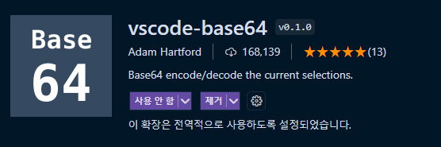
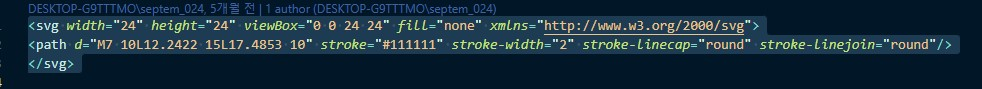
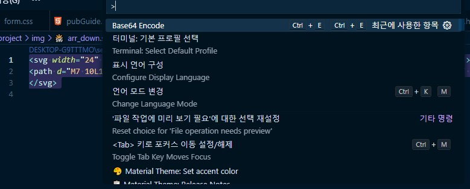
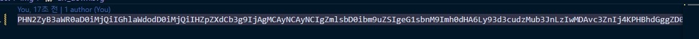

출처 : velog,  2022년 03월 17일, [https://velog.io/@fkszm3/SVG%EB%9E%80](https://velog.io/@fkszm3/SVG%EB%9E%80)<br>

### SVG란 <a id="svg" href="#svg">#</a>

>SVG(Scalable Vector Graphics)는 2차원 벡터 그래픽을 서술하는 XML 기반의 마크업 언어입니다. SVG는 텍스트 기반의 열린 웹 표준 중 하나로, 모든 사이즈에서 깔끔하게 렌더링 되는 이미지를 서술하며 CSS, DOM, JavaScript, SMIL (en-US) 등 다른 웹 표준과도 잘 동작하도록 설계됐습니다. SVG는 달리 말하자면 HTML과 텍스트의 관계를 그래픽에 적용한 것입니다. -MDN

##### 장점
- **웹사이트 로딩 속도가 빠르다.**<br>SVG는 XML코드이기 때문에 파일의 크기가 작습니다. 사용 사례에 따라서 SVG는 60%에서 80%정도의 대역폭을 절감한다고 합니다. SVG는 HTML파일에 작성이 될 수 있기때문에 외부 이미지를 가져오기 위해서 HTTP request를 할 필요가 없습니다.
- **어떤 크기에서든 재활용이 가능 (Future Proof)**<br>SVG는 크기에 따라 이미지가 왜곡되거나 품질이 떨어져 보이지 않습니다. 그렇기 때문에 하드웨어 해상도가 높은 디바이스에서도 품질 저하없이 볼 수 있습니다.
- **SEO 친화적이다**<br>XML코드에는 키워드, 설명, 링크 등이 포함될 수 있습니다. 그래서 해당 콘텐츠를 검색 엔진에서 더 쉽게 인실할 수 있도록 할 수 있습니다.
- **개발 효율 증대 효과**<br>디자이너들은 Figma, Sketch 등에서 디자인한 작업물들을 SVG로 내보낼 수 있습니다. 직접 개발자가 SVG로 다운받을 수도 있습니다. 번거로운 작업을 줄일 수 있습니다.
- **CSS로 디자인 수정이 가능하다.**<br>또한 개발자는 SVG파일을 코드로 직접 변경할 수 있기때문에 디자이너에게 재요청 및 기다릴 필요가 없어지고 디자이너는 이미지를 수정할 필요가 없습니다.


##### 단점
- **너무 복잡한 SVG는 비효율적일 수 있다.**<br>많은 모양, 색상, 그라디언트를 포함하여서 파일 크기가 JPG나 PNG 보다 커지는 경우가 종종 있기 때문에 단점이 될 수 있습니다.
- **최적화**<br>다양한 편집툴에서 내보내진 SVG 파일에는 중복되고 쓸모없는 정보가 많이 포함되어 있습니다. 예를 들어, 편집기의 메타 데이터, 주석, 숨겨진 요소가 있습니다. 최적화 되지 않은 경우에는 PNG보다 파일 크기가 커질 수 있기때문에 최적화를 할 수 있는 도구의 도움을 받는 것이 좋을 수 있습니다.

### svg 활용
**1. 마스크**
<script async src="//jsfiddle.net/qtefkow2/5/embed/html,css,result/"></script>
```html
<div class="mask-ico-help"></div>
```
```css
.mask-ico-help{display: inline-block; width:24px; height:24px; background-color: red;
	-webkit-mask-image: url(data:image/svg+xml;base64,PHN2ZyB3aWR0aD0iMjQiIGhlaWdodD0iMjQiIHZpZXdCb3g9IjAgMCAyNCAyNCIgZmlsbD0ibm9uZSIgeG1sbnM9Imh0dHA6Ly93d3cudzMub3JnLzIwMDAvc3ZnIj4KPGNpcmNsZSBjeD0iMTIiIGN5PSIxMiIgcj0iOSIgc3Ryb2tlPSIjRTBFMEUwIiBzdHJva2Utd2lkdGg9IjEuNSIvPgo8cGF0aCBkPSJNMTAgMTBWOS43NUMxMCA4LjUwNzM2IDExLjAwNzQgNy41IDEyLjI1IDcuNUgxMi40MTNDMTMuNTY1NiA3LjUgMTQuNSA4LjQzNDM5IDE0LjUgOS41ODcwMlY5LjY1MzcxQzE0LjUgMTAuNDY2OCAxNC4wMDUgMTEuMTk4IDEzLjI1IDExLjVWMTEuNUMxMi40OTUgMTEuODAyIDEyIDEyLjUzMzIgMTIgMTMuMzQ2M1YxMy41IiBzdHJva2U9IiNFMEUwRTAiIHN0cm9rZS13aWR0aD0iMS41IiBzdHJva2UtbGluZWNhcD0icm91bmQiLz4KPHBhdGggZD0iTTEyIDE2VjE2LjAwMSIgc3Ryb2tlPSIjRTBFMEUwIiBzdHJva2Utd2lkdGg9IjIiIHN0cm9rZS1saW5lY2FwPSJyb3VuZCIvPgo8L3N2Zz4K);
	mask-image: url(data:image/svg+xml;base64,PHN2ZyB3aWR0aD0iMjQiIGhlaWdodD0iMjQiIHZpZXdCb3g9IjAgMCAyNCAyNCIgZmlsbD0ibm9uZSIgeG1sbnM9Imh0dHA6Ly93d3cudzMub3JnLzIwMDAvc3ZnIj4KPGNpcmNsZSBjeD0iMTIiIGN5PSIxMiIgcj0iOSIgc3Ryb2tlPSIjRTBFMEUwIiBzdHJva2Utd2lkdGg9IjEuNSIvPgo8cGF0aCBkPSJNMTAgMTBWOS43NUMxMCA4LjUwNzM2IDExLjAwNzQgNy41IDEyLjI1IDcuNUgxMi40MTNDMTMuNTY1NiA3LjUgMTQuNSA4LjQzNDM5IDE0LjUgOS41ODcwMlY5LjY1MzcxQzE0LjUgMTAuNDY2OCAxNC4wMDUgMTEuMTk4IDEzLjI1IDExLjVWMTEuNUMxMi40OTUgMTEuODAyIDEyIDEyLjUzMzIgMTIgMTMuMzQ2M1YxMy41IiBzdHJva2U9IiNFMEUwRTAiIHN0cm9rZS13aWR0aD0iMS41IiBzdHJva2UtbGluZWNhcD0icm91bmQiLz4KPHBhdGggZD0iTTEyIDE2VjE2LjAwMSIgc3Ryb2tlPSIjRTBFMEUwIiBzdHJva2Utd2lkdGg9IjIiIHN0cm9rZS1saW5lY2FwPSJyb3VuZCIvPgo8L3N2Zz4K);  
}
```
**2. svg 컬러값을 currentColor로**
<script async src="//jsfiddle.net/defghi1977/KtCht/1/embed/html,css,result/"></script>
```html
<svg version="1.1" id="Layer_1" xmlns="http://www.w3.org/2000/svg" xmlns:xlink="http://www.w3.org/1999/xlink" x="0px" y="0px"
	 width="460px" height="400px" viewBox="0 0 460 400" enable-background="new 0 0 460 400" xml:space="preserve">
<circle fill="none" stroke="currentColor" stroke-width="30" stroke-miterlimit="10" cx="232.083" cy="200.002" r="182.624"/>
<g>
	<polygon fill="none" stroke="currentColor" stroke-width="16" stroke-miterlimit="10" points="248.075,180.326 168.244,97.687 
		207.524,205.666 	"/>
	<polygon fill="currentColor" stroke="currentColor" stroke-width="16" stroke-miterlimit="10" points="256.642,194.337 295.922,302.315 216.09,219.677 	"/>
</g>
</svg>
```

```css
svg:hover {
    color:#dd6127;  
}
```

**3. Visual Studio_extension 활용 [base64]**

  - 확장팩 다운로드 : Image To Base64, vscode-base64
  
  
  - svg 코드 전체선택 (복사X)
  
  
  - ctrl + shift + p → base64 encode 클릭 (base64로 변환됨)
  
  
  - 변환된 코드를 복사한 후 data:image/svg+xml;base64, 뒤에 불여넣기<br>
  (background:url(data:image/svg+xml;base64,복사한코드;))
  ```css
  background:url(data:image/svg+xml;base64,PHN2ZyB3aWR0aD0iMjQiIGhlaWdodD0iMjQiIHZpZXdCb3g9IjAgMCAyNCAyNCIgZmlsbD0ibm9uZSIgeG1sbnM9Imh0dHA6Ly93d3cudzMub3JnLzIwMDAvc3ZnIj4KPHBhdGggZD0iTTcgMTBMMTIuMjQyMiAxNUwxNy40ODUzIDEwIiBzdHJva2U9IiMxMTExMTEiIHN0cm9rZS13aWR0aD0iMiIgc3Ryb2tlLWxpbmVjYXA9InJvdW5kIiBzdHJva2UtbGluZWpvaW49InJvdW5kIi8+Cjwvc3ZnPgo=);
  ```

더 좋은 방법이 있으면 추가하도록 하겠습니다...

---
[목록으로](/)
