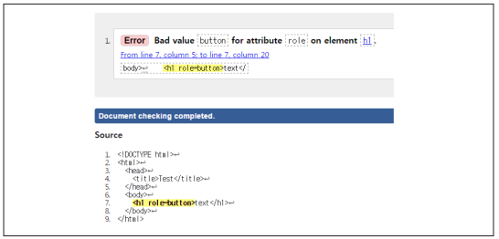

출처 : velog,  2021년 3월 17일, [https://velog.io/@kym123123/ARIA%EC%9D%98%EC%86%8D%EC%84%B1%EC%83%81%ED%83%9C%EC%97%AD%ED%95%A0%EB%B0%8F%EC%82%AC%EC%9A%A9-%EC%98%88%EC%8B%9C%EC%A3%BC%EC%9D%98%EC%82%AC%ED%95%AD](https://velog.io/@kym123123/ARIA%EC%9D%98%EC%86%8D%EC%84%B1%EC%83%81%ED%83%9C%EC%97%AD%ED%95%A0%EB%B0%8F%EC%82%AC%EC%9A%A9-%EC%98%88%EC%8B%9C%EC%A3%BC%EC%9D%98%EC%82%AC%ED%95%AD)<br>
출처 : W3C 웹 접근성 연구소,  2016년 12월 04일,[https://www.wah.or.kr:444/board/boardView.asp?page=1&brd_sn=5&brd_idx=1019](https://www.wah.or.kr:444/board/boardView.asp?page=1&brd_sn=5&brd_idx=1019)<br>
출처 : NULI,  2018년 12월 10일,[https://nuli.navercorp.com/community/article/1132937](https://nuli.navercorp.com/community/article/1132937)

출처 : 레진 가이드,  2021년 05월 05일,[https://github.com/lezhin/accessibility/blob/master/aria/README.md#tooltip](https://github.com/lezhin/accessibility/blob/master/aria/README.md#tooltip)
1. [ARIA](#aria)
2. [ARIA 사용규칙](#aria-rule)
3. [참고 코드](#aria-reference)
### ARIA <a id="aria" href="#aria">#</a>

##### role(역할): 특정 요소에 역할정의, 사용자에게 정보제공, 부여한 역할 동적변경 불가

- **role="application"**
  - 동일한 역할의 요소 없음.
  - 주로 `<div>` 요소와 같이 그룹 역할을 하는 요소로 대체할 수 있다.
  ```html
  <div role="application">
    <h1>간단한 계산기</h1>
    <label for="operand1">첫 번째 피연산자:</label>
    <input type="number" id="operand1">

    <label for="operand2">두 번째 피연산자:</label>
    <input type="number" id="operand2">

    <button id="addButton">덧셈</button>
    <button id="subtractButton">뺄셈</button>

    <div role="status" aria-live="assertive">결과: <span id="result">0</span></div>
  </div>

  ```
- **role="banner"**
  - 동일한 역할의 요소 없음.
  - 비슷한 의미로 `<header>`요소를 사용할 수 있으나 `<header role="banner">` 로 사용시 1페이지에서 1개만 사용하기를 권장.
  ```html
  <header role="banner">
    <h1>예시 웹 사이트</h1>
    <nav>
      <ul>
        <li><a href="#">홈</a></li>
        <li><a href="#">소개</a></li>
        <li><a href="#">서비스</a></li>
        <li><a href="#">문의</a></li>
      </ul>
    </nav>
  </header>
  ```
- **role="navigation"**
  - `<nav>` 요소.
  - 다른 페이지 또는 페이지 내 특정 영역으로 이동하는 링크 콘텐츠 영역으로 주로 메인 메뉴 및 서브 메뉴 등에 사용할 수 있다.
:`<nav>`와 동일
  ```html
  <!-- O: 탐색에 nav 요소를 권장 -->
  <nav>
      <h2>글로벌 네비게이션</h2>
      ...
  </nav>

  <!-- O: 탐색 역할을 하는 요소가 유일한 경우 레이블 생략 가능 -->
  <div role="navigation">
      <h2>글로벌 네비게이션</h2>
      ...
  </div>

  <!-- O: 탐색 역할이 둘 이상인 경우 레이블 제공(nav) -->
  <nav aria-labelledby="global-navigation">
      <h2 id="global-navigation">글로벌 네비게이션</h2>
      ...
  </nav>
  <nav aria-labelledby="notice-pagination">
      <h3 id="notice-pagination">공지사항 페이지네이션</h3>
      ...
  </nav>

  <!-- O: 탐색 역할이 둘 이상인 경우 레이블 제공(role="navigation") -->
  <div role="navigation" aria-labelledby="global-navigation">
      <h2 id="global-navigation">글로벌 네비게이션</h2>
      ...
  </div>
  <div role="navigation" aria-labelledby="notice-pagination">
      <h3 id="notice-pagination">공지사항 페이지네이션</h3>
      ...
  </div>
  ```
- **role="main"**
  - `<main>`요소.
  - 본문의 주요 콘텐츠 영역으로 한 페이지 내에 1개만 사용이 가능하며,<br>`<article>`, `<aside>`, `<footer>` 요소의 하위 요소로 사용할 수 없다
  ```html
  <header><!-- 웹 페이지의 머리글 영역 --></header>
  <main role="main">
    <!-- 웹 페이지의 주요 콘텐츠 영역 -->
    <h1>환영합니다!</h1>
    <p>이곳은 예시 웹 페이지의 주요 콘텐츠입니다.</p>
    <section>
      <h2>섹션 1</h2>
      <p>섹션 1의 내용입니다.</p>
    </section>
    <section>
      <h2>섹션 2</h2>
      <p>섹션 2의 내용입니다.</p>
    </section>
  </main>
  <footer><!-- 웹 페이지의 바닥글 영역 --></footer>
  ```
- **role="complementarye"** /  **role="aside"**
  - `<aside>` 요소.
  - 보충적인 콘텐츠를 정의하는 데 사용됩니다. 
  - 이 역할은 주요 컨텐츠의 보충적인 정보를 제공하며, 일반적으로 사이드바, 광고, 관련 링크 등을 포함합니다. 주로 주요 컨텐츠를 보완하는 역할을 수행합니다.

  - role="aside HTML에서 콘텐츠의 부가 정보를 정의하는 데 사용됩니다. 이 역할은 주요 컨텐츠와는 독립적인 사이드바, 노트, 광고 등과 같은 콘텐츠를 나타냅니다. 일반적으로 주요 컨텐츠와는 분리되어 표시되며, 보조적인 정보를 제공하는 역할을 수행합니다.
  ```html
  <!-- O: 보충에 aside 요소를 권장 -->
  <aside>
      <h2>배너/광고</h2>
      ...
  </aside>

  <!-- O: 보충 역할을 하는 요소가 유일한 경우 레이블 생략 가능 -->
  <div role="complementary">
      <h2>배너/광고</h2>
      ...
  </div>

  <!-- O: 보충 역할이 둘 이상인 경우 레이블 제공(aside) -->
  <aside aria-labelledby="event">
      <h2 id="event">이벤트</h2>
      ...
  </aside>
  <aside aria-labelledby="advertisement">
      <h2 id="advertisement">배너/광고</h2>
      ...
  </aside>

  <!-- O: 보충 역할이 둘 이상인 경우 레이블 제공(role="complementary") -->
  <div role="complementary" aria-labelledby="event">
      <h2 id="event">이벤트</h2>
      ...
  </div>
  <div role="complementary" aria-labelledby="advertisement">
      <h2 id="advertisement">배너/광고</h2>
      ...
  </div>
  ```
  
>위 **role="aside"** 과 **role="complementarye"** 은 혼용해서 사용이 가능하나 주의할 점은 역할을 일관되게 사용하는 것이 좋다는 점입니다. 예를 들어, 사이드바로 사용할 요소에는 **"role="aside""**를 사용하고, 다른 요소를 사용하여 보충적인 콘텐츠를 표시하려면 **role="complementarye"**를 사용하는 것이 일관성을 유지하는 방법입니다.

- **role="form"**
  - `<form>` 요소.
  - 폼과 관련된 요소의 모임을 표현하는 영역으로 서버에 전송될 수 있는 콘텐츠를 포함 할 수 있다.
  ```html
  <div role="form" aria-labelledby="form-title">
    <h2 id="form-title">회원 가입</h2>
    <form>
      <label for="name">이름:</label>
      <input type="text" id="name">
      <button type="submit">가입하기</button>
    </form>
  </div>
  ```
- **role="search"**
  - 동일한 역할의 요소 없음. 
  - 검색의 역할을 담당하는 서식 영역임을 의미하며 `<div>` 또는 `<form>` 요소를 사용하는 것을 권장한다.
  ```html
  <div role="search">
    <label for="search-input">검색:</label>
    <input type="text" id="search-input" placeholder="검색어를 입력하세요">
    <button type="submit">검색</button>
  </div>
  ```
- **role="contentinfo"**
  - 동일한 역할의 요소 없음.
  - 비슷한 의미로 `<footer>` 요소를 사용할 수 있으나 `<footer role=“contentinfo”>`로 사용하였
다면 한 페이지에서 한 개의 `<footer>` 요소만 사용하길 권장한다.
  - 컨텐츠 정보 영역은 주로 웹 페이지의 바닥글 영역으로 사용되며, 저작권 정보, 사이트 링크 등과 같은 추가 정보를 제공합니다.
  ```html
  <footer role="contentinfo">
    <p>저작권 © 2023 예시 웹사이트. 모든 권리 보유.</p>
    <nav>
      <ul>
        <li><a href="#">이용 약관</a></li>
        <li><a href="#">개인정보 처리방침</a></li>
        <li><a href="#">사이트맵</a></li>
      </ul>
    </nav>
  </footer>
  ```

- **role="button"**
  - p, span, div에서도 버튼컨트롤로 사용된다는 것을 스크린리더에 인식시킬 수 있다.
  가능하면 button role보다 기본 html의 `<button>`, `<input type="button">`, `<input type="submit">`을 사용해야 한다. 기본html요소들은 추가 사용자 정의 없이 키보드 포커스를 지원한다.<br>
  

- **탭 목록, 탭, 탭 패널(role="tablist|tab|tabpanel")**
  - 탭은 스타일을 의미하는 것이 아니라 현재 페이지 내용에 색인을 제공하는 구조(tablist, tab, tabpanel)를 의미합니다. 사이트 탐색 도구에 해당하는 요소는 nav > h2 + ul 또는 aside > h2 + ul 구조로 마크업 합니다.
  ```html
  <!-- O: 앵커 형식 탭 -->
  <div class="weekly">
      <div role="tablist">
          <a id="mon-anchor" href="#mon" role="tab" aria-selected="true">월</a>
          <a id="tue-anchor" href="#tue" role="tab" aria-selected="false">화</a>
      </div>
      <div id="mon" tabindex="0" role="tabpanel" aria-labelledby="mon-anchor">
          월요일엔 빨간 장미를...
      </div>
      <div id="tue" tabindex="0" role="tabpanel" aria-labelledby="tue-anchor" hidden>
          화요일엔 노란 장미를...
      </div>
  </div>

  <!-- O: 버튼 형식 탭 -->
  <div class="weekly">
      <div role="tablist">
          <button type="button" id="mon-anchor" aria-controls="mon" role="tab" aria-selected="true">월</button>
          <button type="button" id="tue-anchor" aria-controls="tue" role="tab" aria-selected="false">화</button>
      </div>
      <div id="mon" tabindex="0" role="tabpanel" aria-labelledby="mon-anchor">
          월요일엔 빨간 장미를...
      </div>
      <div id="tue" tabindex="0" role="tabpanel" aria-labelledby="tue-anchor" hidden>
          화요일엔 노란 장미를...
      </div>
  </div>
  ``` 
  - role 속성은 값에 따라 적용할 수 있는 HTML 요소가 제한되어 있습니다. 예를 들면 role="tabpanel" 속성은 `<ul>`요소에 사용할 수 없으므로 적용 시 HTML5 요소 명세를 확인해야 합니다.

- **role="presentation", role="none"**
  - semantic의미를 요소와 그 자식요소로부터 제거하기 위해서 사용한다. 시각적으로 게시하는 용도의 요소에 적용. none은 최근에 나온 속성값으로 presentation과 같은역할을 한다. 호환성문제가 있을 수 있으니까 두개 다 기입해 주는것이 좋음.
  ```html
  <div role="presentation">
    <h1>Contact Information</h1>
    <p>Name: John Doe</p>
    <p>Email: johndoe@example.com</p>
    <p>Phone: 123-456-7890</p>
  </div>
  ```
  HTML에서의 각 요소는 고유한 역할을 가지고 있습니다. 예를 들어, a 태그는 링크, button 태그는 버튼과 같은 역할 등이 부여되어 있습니다. 이러한 요소의 역할을 브라우저의 접근성 API를 통해 보조기술 사용자에게 전달합니다. 웹페이지를 제작할 때 HTML의 부여된 기본적인 역할로 마크업할 수 있지만, 메시지 목록, 메뉴 모음과 같은 위젯을 제작하거나 HTML에서 지원하지 않는 역할을 ARIA로 제공하고자 할 때 또는 마크업한 요소의 의미를 제거하고 내용만을 보조기술 사용자에게 전달하려 할 때 presentation 역할을 사용할 수 있습니다.

- **role="group"**
  - 라디오 버튼과 같이 여러개의 옵션 중 한가지를 선택 할 때, name속성값에 같은 값을 넣어줘서 그룹화 하더라도 스크린리더 사용자는 시각적으로 볼수있는 사용자와 달리 묶여있는 그룹이라는 것을 인식하기 어렵다. 이러한경우 role="group"를 부여하여 같은 그룹이라는 것을 인식시킨다
  ```html
  <div id="classtxt">Cabin Class</div>
  <ul role="group" aria-labelledby="classtxt">
      <li>
          <input id="economy" type="radio" value="economy" 
          checked="checked" name="cabin">
          <label for="economy">Economy Class</label>
      </li>
      <li>
          <input id="Prestige " type="radio" value="Prestige" name="cabin">
          <label for="Prestige ">Prestige Class</label>
      </li>
      <li>
          <input id="First" type="radio" value="First" name="cabin">
          <label for="First">First Class</label>
      </li>
  </ul>
  ```
- **role="tooltip"**
  - 툴팁은 앵커 또는 폼 콘트롤 요소에 대한 참고용 콘텐츠입니다. 보통 마우스 오버 또는 키보드 초점을 받으면 표시하는 내용이지만 화면에 항상 표시할 수도 있습니다. 툴팁 요소에 role="tooltip" 속성으로 명시할 수 있습니다. 툴팁을 유발하는 앵커 또는 콘트롤에 aria-describedby="ID reference list" 속성을 명시하여 연결합니다.
  ```htmls
  <!-- O: 인풋 툴팁 -->
  <label for="tel">전화번호</label>
  <input id="tel" type="tel" aria-describedby="TIP-TEL">
  <p id="TIP-TEL" role="tooltip" hidden>하이픈(-) 없이 숫자만 입력.</p>

  <!-- O: 버튼 툴팁 -->
  <button aria-describedby="TIP-DEL">게시물 삭제</button>
  <p id="TIP-DEL" role="tooltip" hidden>게시물 삭제 후 복원할 수 없음.</p>
  ```
  * `role="alert"` 또는 `role="alertdialog"` 또는 `role="dialog"` 콘텐츠와 혼동하지 않도록 유의합니다.

- **성공(결과) 메시지(role="status").**
  - 성공(또는 결과) 상태 메시지를 사용자에게 전달하는 콘텐츠입니다. 사용자의 현재 작업을 방해하지 않고(초점을 옮기지 않고) 보조기기 사용자에게 조언할만한 메시지를 전달하는 것을 의도하고 있습니다. `role="alert"` 만큼 중요하지 않습니다.

  - 성공 `role="status"` 메시지는 초점을 받지 않도록 처리해야 합니다. `role="status"` 요소는 `aria-live="polite"` 속성과 `aria-atomic="true"` 속성을 암시적으로 할당하기 때문에 추가로 선언할 필요가 없습니다. 성공 메시지 영역을 변경하면 화면 낭독기는 현재 진행 중인 음성 안내를 마친 후 성공 메시지 전체 내용을 사용자에게 전달합니다.
    ```html
    <!-- O: 성공 메시지 -->
    <p role="status">회원가입 양식 전송완료.</p>

    <!-- O: 결과 메시지 -->
    <p role="status">10개의 검색 결과.</p>
    <p role="status">장바구니에 5개의 항목.</p>
    ```
- **오류(제안) 메시지(role="alert").**
  - 시간에 민감하고 중요한(오류, 제안) 메시지를 사용자에게 전달하는 콘텐츠입니다. 사용자의 현재 작업을 방해하지 않고(초점을 옮기지 않고) 보조기기 사용자에게 즉각 메시지를 전달하는 것을 의도하고 있습니다.

  - 오류 role="alert" 메시지는 초점을 받지 않도록 처리해야 합니다. role="alert" 요소는 aria-live="assertive" 속성과 aria-atomic="true" 속성을 암시적으로 할당하기 때문에 추가로 선언할 필요가 없습니다. 오류 메시지 영역을 변경하면 화면 낭독기는 현재 진행 중인 음성 안내를 즉시 멈추고 오류 메시지 전체 내용을 사용자에게 전달합니다.
  ```html
  <!-- O: 오류 메시지 -->
  <p role="alert">우편번호 입력 오류.</p>

  <!-- O: 제안 메시지 -->
  <p role="alert">로그인 후 이용 가능.</p>
  ```
  - 초점을 받을 수 있는 사용자 인터렉션 요소를 포함하고 있다면 알럿 대화상자 role="alertdialog" 또는 대화상자 role="dialog"를 사용합니다.<br>
  사용자 입력 콘트롤(input, textaria)의 실시간 오류를 표시하는 경우라면 오류 메시지 대신 콘트롤 요소에 aria-invalid="true|false" 속성과 aria-errormessage="ID reference" 속성을 사용합니다.

- **알럿 대화상자(role="alertdialog"**
  - 사용자 동의 또는 확인이 필요한 인터렉션 요소(input, button)를 포함한 상태로 다른 과업을 차단하는 경우 알럿 대화상자   role="alertdialog"를 사용합니다. 사용자 입력 없이 '확인, 취소' 버튼을 제공하는 경우에 적절합니다.

  - 알럿 대화상자에는 aria-labelledby="ID reference list" 그리고 aria-describedby="ID reference list" 속성으로 알럿     대화상자의 제목과 설명을 연결합니다.

  - 알럿 대화상자는 다른 과업을 차단해야 하기 때문에 모달 윈도우 스타일로 처리한 다음 aria-modal="true" 속성을 추가합니다.

  - 알럿 대화상자를 표시할 때 키보드 초점을 대화상자 내부 첫 번째 콘트롤(예를 들면 '확인' 버튼 또는 '인풋')으로 옮겨야 합니다. 알럿 대화상자를 표시하는 동안 초점은 대화상자 안에서 벗어나지 않아야 합니다.

  ```html
  <!-- O: 알럿 대화상자 -->
  <div role="alertdialog" aria-modal="true" aria-labelledby="TITLE" aria-describedby="DESCRIPTION">
      <h2 id="TITLE">레진패스 안내</h2>
      <p id="DESCRIPTION">이 작품의 유료 에피소드 열람 시 자동으로 구매합니다. 레진패스를 적용하시겠습니까?</p>
      <button type="button">레진패스 적용</button>
      <button type="button">취소</button>
  </div>
  ```
  - 사용자가 응답할 필요 없는 내용이라면 role="alert" 속성이 적절합니다. 사용자가 하위창 맥락으로 벗어나 정보를 입력(input, textarea, select, button)하는 경우라면 대화상자 role="dialog"가 적절합니다.

- **대화상자(role="dialog").**
  - 대화상자 role="dialog"는 사용자 인터렉션이 필요한 현재 문서의 하위창(마치 윈도우 팝업)입니다. 사용자가 정보를 입력하거나 응답하도록 하는 내용(input, textarea, select, button)을 반드시 포함합니다.

  - 대화상자에는 aria-labelledby="ID reference list" 또는 aria-label="string" 속성으로 설명을 제공합니다.

  - 대화상자를 표시할 때 키보드 초점을 대화상자 내부 첫 번째 콘트롤으로 옮겨야 합니다. 대화상자를 표시하는 동안 초점은 대화상자 안에서 벗어나지 않아야 합니다.

  - 모달 스타일로 표시할 것인지 여부는 선택 사항입니다. 모달 스타일로 처리하는 경우 aria-modal="true" 속성을 추가합니다.
    ```html
    <!-- O: 대화상자 -->
    <section role="dialog" aria-modal="true" aria-labelledby="TITLE">
        <h2 id="TITLE">로그인</h2>
        <form>
            <label for="ID">아이디</label>
            <input id="ID">
            <label for="PW">비밀번호</label>
            <input id="PW" type="password">
            <button>로그인</button>
        </form>
    </section>
    ```
  - 사용자의 다른 과업을 차단하면서 '확인, 취소' 버튼만 제공하는 경우라면 role="alertdialog" 속성이 적절합니다. 사용자가 응답할 필요 없는 내용이라면 role="alert" 속성이 적절합니다.<br>
  대중적인 브라우저가 <dialog> 요소를 충분히 지원하면 role="dialog" 속성 대신 <dialog> 요소를 사용합니다.

##### properties(속성) &states(상태) :<br> 요소가 기본적으로 가진 특징이나 상황에서 "aria-"라는 접두어를 갖는다.
**상태: 요소의 상황을 나타내므로 application 실행 중 자주 바뀐다.**<br>
**속성: 상대적으로 바뀌는 정도가 드물다.**
##### 상태
- **현재 상태(aria-current="token"**).
  - aria-current 속성은 현재 맥락과 일치하는 항목을 의미합니다. token 값은 정해진 값 중 하나만 사용할 수 있음을 의미합니다. 예를 들면 aria-current 속성의 token 값은 page|step|location|date|time|true|false(default) 으로 정해져 있고 이 중 하나만 사용할 수 있습니다.
    - page: 현재 '페이지'와 일치하는 시각적으로 강조한 링크.
    - step: 현재 '단계'와 일치하는 시각적으로 강조한 링크.
    - location: 플로우 차트에서 현재 '위치'와 일치하는 시각적으로 강조한 이미지.
    - date: 달력에서 현재 '날짜'와 일치하는 날짜.
    - time: 시간표에서 현재 '시간'과 일치하는 시간.<br><br>
  이 밖에 true와 false 값도 있습니다. true 또는 false 값은 구체적으로 어떤 맥락(페이지, 단계, 위치, 날짜, 시간)과 일치하는지 정보를 전달하지 않기 때문에 page|step|location|date|time 토큰이 적절하지 않은 맥락에 한하여 사용합니다.<br><br>
    - true: 항목이 세트 내 현재 맥락과 일치함.
    - false(default): 항목이 세트 내 현재 맥락과 일치하지 않음. 속성 또는 값을 선언하지 않은 경우 초기값.
    ```html
    <!-- O: aria-current="page" 현재 페이지 강조 링크 -->
    <nav>
        <h2>글로벌 네비게이션</h2>
        <ul>
            <li><a href="/home" aria-current="page">홈</a></li>
            <li><a href="/ongoing">연재</a></li>
            <li><a href="/ranking">랭킹</a></li>
        </ul>
    </nav>

    <!-- O: aria-current="step" 현재 단계 강조 링크 -->
    <nav>
        <h2>회원 가입</h2>
        <ol>
            <li><a href="/accept-terms" aria-current="step">약관 동의</a></li>
            <li><a href="/id-password">아이디/비밀번호 생성</a></li>
            <li><a href="/email-authentication">이메일 인증</a></li>
        </ol>
    </nav>

    <!-- O: aria-current="location" 현재 위치 강조 이미지 -->
    
    
    

    <!-- O: aria-current="date" 현재 날짜 강조 -->
    <td aria-curent="date">12/24(토)</td>
    <td>
        <button type="button" aria-curent="date">12/24(토)</button>
    </td>

    <!-- O: aria-current="time" 현재 시간 강조 -->
    <th scope="row" aria-current="time">18:00 ~ 20:00</th>
    <td>무한 도전</td>
    ```
- **선택 상태(aria-selected="true|false|undefined").**
  - aria-selected 속성은 단일 또는 다중 선택이 가능한 요소(role="gridcell|option|row|tab")에 한하여 선택 상태를 명시하는 용도로 사용합니다. role="tab" 요소에 가장 흔히 사용합니다. 키보드 초점을 받을 수 있는 요소에 적용해야 합니다.
    - undefined(default): 속성 또는 값을 선언하지 않은 경우 초기값. 선택할 수 없음.
    - true: 선택 가능한 요소를 선택했음.
    - false: 선택 가능한 요소를 선택하지 않았음.<br>

    선택 요소에만 aria-selected="true" 속성을 적용하면 aria-selected 속성을 적용하지 않은 요소는 aria-selected="undefined" 상태(선택할 수 없음)가 됩니다. 따라서 선택하지 않은 요소에는 명시적으로 aria-selected="false" 속성과 값을 적용합니다.
    <br>
    ```html
    <!-- O: role="tab" 요소에 선택 상태를 명시 -->
    <div role="tablist">
        <a id="mon-anchor" href="#mon" role="tab" aria-selected="true">월</a>
        <a id="tue-anchor" href="#tue" role="tab" aria-selected="false">화</a>
    </div>
    ```
  - aria-selected 속성은 aria-current 속성과 다른 의미로 사용하기 때문에 혼동하지 않도록 유의합니다. aria-selected 속성은 선택 가능한 요소에, aria-current 속성은 현재 맥락과 일치하는 요소에 사용합니다. aria-selected 속성은 단일 또는 다중 선택이 가능한 요소(role="gridcell|option|row|tab")에 제한적으로 사용할 수 있습니다. 예를 들면 페이지네이션에서 현재 페이지와 일치하는 링크에는 aria-selected 속성이 적절하지 않고 aria-current 속성이 적절합니다.

- **팝업 상태(aria-haspopup="token").**
  - aria-haspopup 속성은 요소에 연결되어 있는 팝업(메뉴, 대화상자 등) 정보를 제공합니다. 팝업은 다른 내용 위에 표시하는 블럭을 의미합니다. 팝업 유형은 menu, listbox, tree, grid, dialog 으로 제한되어 있기 때문에 의미가 정확하게 일치하는 경우에만 사용해야 합니다. 일반적으로 menu와 dialog 유형이 빈번하므로 많이 사용할 것입니다.
    - true: menu와 동일한 의미.
    - menu: menu(role) 팝업이 연결됨. menu(role)는 링크 목록.
    - dialog: dialog(role) 팝업이 연결됨. dialog(role)는 상호작용 요소(버튼 또는 콘트롤)가 포함된 현재 문서의 하위창.
    - listbox: listbox(role) 팝업이 연결됨. listbox(role)는 선택 가능한 option(role)을 포함한 콤보박스.
    - tree: tree(role) 팝업이 연결됨. tree(role)는 하위 list(role)을 포함하며 접고 펼칠 수 있음.
    - grid: grid(role) 팝업이 연결됨. grid(role)는 행과 열로 구성된 선택 가능한 위젯. 상호작용 가능한 셀이기 때문에 table(role)과는 역할이 다름에 유의.
    - false(default): 연결된 팝업이 없음을 의미.
      ```html
      <!-- O: aria-haspopup="menu|true" -->
      <button type="button" id="menu-button" aria-haspopup="menu" aria-controls="menu-list" aria-expanded="false">메뉴</button>
      <ul id="menu-list" role="menu" aria-labelledby="menu-button" hidden>
          <li>
              <a href="/completed">완결</a>
          </li>
          <li>
              <a href="/printed">단행본</a>
          </li>
      </ul>

      <!-- O: aria-haspopup="dialog"-->
      <a href="#login-dialog" aria-haspopup="dialog">로그인</a>
      <section id="login-dialog" role="dialog" aria-labelledby="login-heading" aria-modal="true" hidden>
          <h2 id="login-heading">로그인</h2>
          <form>
              <label for="id-input">아이디</label>
              <input id="id-input" type="text">
              <label for="pw-input">비밀번호</label>
              <input id="pw-input" type="password">
              <button type="submit">로그인</button>
          </form>
      </section>
      ```
  - 연결한 팝업 role이 암시적인 경우에도 aria-haspopup 속성을 연결할 수 있습니다. 예를 들어 연결된 팝업이 <dialog> 요소라면 암시적으로 role="dialog" 속성을 지닌 것이므로 aria-haspopup="dailog" 속성을 사용할 수 있습니다. 대중적인 브라우저가 <dialog> 요소를 충분히 지원하면 role="dialog" 속성 대신 <dialog> 요소를 사용합니다.

- **확장 상태(aria-expanded="true|false|undefinded").**
  - aria-expanded 속성은 제어 대상의 확장 또는 축소 상태를 나타냅니다. 어코디언, 메뉴, 콤보박스, 트리와 같이 하위 그룹(또는 독립적인) 내용을 토글(열기, 닫기)하는 경우에 사용하면 적절합니다. 독립적인 내용을 제어할 때 aria-controls 속성을 이용하여 제어 대상을 명시해야 합니다.
    - undefined(default): 속성 또는 값을 선언하지 않은 경우 초기값. 제어 대상이 없거나 모두 확장 상태. 확장/축소 제어 불가능.- true: 요소 또는 제어 대상 확장 상태. 
    - false: 요소 또는 제어 대상 축소 상태. 
      ```html
      <!-- O: 어코디언 -->
      <dt>
          <button type="button" aria-controls="answer-99" aria-expanded="false">보너스 코인은 언제 소진되나요?</button>
      </dt>
      <dd id="answer-99" hidden>
          <p>만료기한이 짧은 보너스 코인이 일반 코인보다 먼저 소진됩니다.</p>
      </dd>

      <!-- O: 팝업 -->
      <a id="popular-btn" href="#popular" aria-haspopup="menu" aria-expanded="false">인기</a>
      <ul id="popular" role="menu" aria-labelledby="popular-btn" hidden>
          <li>
              <a href="#romance">로맨스</a>
          </li>
          <li>
              <a href="#drama">드라마</a>
          </li>
      </ul>
      ```
    - 이 밖에도 툴팁(role="tooltip"), 알럿(role="alert"), 알럿 대화상자(role="alertdialog"), 대화상자(role="dialog")와 같이 동적으로 표시 상태를 결정(토글)하는 요소에 aria-expanded 속성을 사용할 수 있습니다.

- **눌림 상태(aria-pressed="tristate")**
  - aria-pressed 속성은 토글 버튼(button, role="button")이 눌린 상태를 표시합니다. 흔하게 사용하는 속성은 아닙니다. 이 속성을 사용하기 전에 input[type="radio"], input[type="checkbox"] 또는 aria-checked 또는 aria-selected 속성을 먼저 검토하는 것이 좋습니다. 속성 값은 일반적으로 true 또는 false 두 가지 값을 사용하지만, tristate 으로 true, false, mixed 세 가지 상태를 모두 표시할 수도 있습니다. mixed 값은 버튼이 제어하는 두 개 이상의 요소 상태값이 모두 true 이거나 모두 false가 아닌 복합적인 상태를 의미합니다
    - undefined(default): 속성 또는 값을 선언하지 않은 경우 초기값. 누름 상태 표시를 지원하지 않는 버튼.
    - true: 버튼을 누른 상태.
    - false: 버튼을 누르지 않은 상태.
    - mixed: true 또는 false 값으로 표시할 수 없는 복합적인 상태.
    ```html
    <!-- O: true/false 모드 -->
    <button type="button" aria-pressed="true">음소거</button>
    <button type="button" aria-pressed="false">음소거</button>

    <!-- O: true/false/mixed 모드(이 예제에서 제어 대상이 하나는 true 이고 하나는 false 이다) -->
    <button type="button" aria-pressed="mixed" aria-controls="noti-text noti-sound">알림 켜기</button>
    <ul>
        <li>
            <input id="noti-text" type="checkbox" checked>
            <label for="noti-text">문자 알림</label>
        </li>
        <li>
            <input id="noti-sound" type="checkbox">
            <label for="noti-sound">소리 알림</label>
        </li>
    </ul>
    ```
    - 토글 버튼이 눌린 상태를 동적 텍스트로 전달하는 경우에는 aria-pressed 속성을 사용하지 않습니다. 예를 들어 버튼 설명 텍스트를 배경음 켜기 그리고 배경음 끄기 형태로 동적으로 변경한다면 aria-pressed 속성을 선언하는 것이 오히려 혼란을 초래합니다.  
- **숨김 상태(aria-hidden="true|false|undefined").**
  - aria-hidden 속성은 접근성 API(보조기기 접근 가능성) 차단 상태를 결정합니다. 화면에 표시하지만 잠시 사용을 제한하는 콘텐츠에 적용합니다. 예를 들면 모달 대화상자를 화면에 표시할 때 모달 대화상자 뒤 본문 콘텐츠에 aria-hidden="true" 속성을 선언하면 보조기기가 무시합니다.
    - undefined(default): 속성 또는 값을 선언하지 않은 경우 초기값. 화면 표시 여부에 따라 접근성 API 차단 상태를 결정. 화면에 표시하면 false, 화면에서 숨기면 true.
    - true: 접근성 API 차단.(화면 표시 여부와 무관 API 차단)
    - false: 접근성 API 사용.(화면에 표시한 경우 API 사용)
    ```html
      <!-- O: 모달 윈도우를 표시할 때 다른 요소를 차단 -->
      <body>
          <div class="container" aria-hidden="true">
              // 보조기기가 무시하는 영역
          </div>
          <div role="alertdialog" aria-modal="true" aria-labelledby="TITLE" aria-describedby="DESCRIPTION">
              <h2 id="TITLE">레진패스 안내</h2>
              <p id="DESCRIPTION">이 작품의 유료 에피소드 열람 시 자동으로 구매합니다. 레진패스를 적용하시겠습니까?</p>
              <button type="button">레진패스 적용</button>
              <button type="button">취소</button>
          </div>
      </body>
    ```
  - hidden 속성은 요소를 화면에 표시하지 않기 때문에 접근 불가능한 상태가 되지만 aria-hidden="true" 속성은 화면 표시 여부와 관계없이 보조기기 접근 불가능 상태를 만듭니다. aria-hidden="true" 속성이 접근성 API를 차단하지만 포인팅 기능(마우스 커서, 키보드 초점)을 차단하는 것은 아니므로 개발자는 aria-hidden="true" 요소가 포인팅을 받지 않도록 처리해야 합니다.
- **오류 상태(aria-invalid="true|false|grammar|spelling").**
  - aria-invalid 속성은 주로 input 요소에 선언하여 사용자가 입력한 값이 요구하는 형식과 일치하는지 여부를 나타냅니다. aria-errormessage 속성과 함께 사용하여 오류 설명을 제공할 수 있습니다.
    - false(default): 오류 없음. aria-invalid 속성을 선언하지 않거나 값이 없으면 false로 간주.
    - true: 오류 있음.
    - grammar: 문법 오류.
    - spelling: 철자 오류.
    ```html
      <!-- O: 입력 값이 유효하면 aria-invalid 속성을 생략 -->
      <label for="email">이메일</label>
      <input id="email" type="email" required value="abc@xyz.xxx" aria-errormessage="email-error-msg">
      <p id="email-error-msg" role="alert" aria-live="assertive" hidden>이메일 형식이 유효하지 않습니다. 앳(@)과 마침표(.)를 포함해 주세요.</p>

      <!-- O: 입력 값이 오류이면 aria-invalid="true" 속성을 선언 -->
      <label for="email">이메일</label>
      <input id="email" type="email" required value="..." aria-invalid="true" aria-errormessage="email-error-msg">
      <p id="email-error-msg" role="alert" aria-live="assertive">이메일 형식이 유효하지 않습니다. 앳(@)과 마침표(.)를 포함해 주세요.</p>
    ```
  - aria-errormessage 속성은 aria-invalid 속성이 없거나 값이 false라면 동작하지 않습니다. 입력 값이 비어 있거나 유효하지 않은 초기 값을 제공한 때에는 aria-invalid="true"를 선언하지 않아야 합니다.


##### 속성

- **제어 대상(aria-controls="ID reference list").**
  - aria-controls 속성은 현재 요소가 제어하는 대상을 명시하는 속성입니다. 주로 role="tab", aria-haspopup, aria-expanded 속성과 함께 `<button>` 요소가 무엇을 제어하는지 명시합니다. aria-controls 속성의 값은 하나 또는 그 이상의 ID 값 입니다. 흔한 경우는 아니지만 ID 값이 여럿인 경우 ID 값을 공백으로 분리합니다.
    ```html
    <!-- O: role="tab" 요소에 aria-controls 속성 사용 -->
    <div role="tablist">
        <button type="button" id="mon-anchor" aria-controls="mon" role="tab" aria-selected="true">월</button>
        <button type="button" id="tue-anchor" aria-controls="tue" role="tab" aria-selected="false">화</button>
    </div>
    <div id="mon" tabindex="0" role="tabpanel" aria-labelledby="mon-anchor">
        월요일 콘텐츠...
    </div>
    <div id="tue" tabindex="0" role="tabpanel" aria-labelledby="tue-anchor" hidden>
        화요일 콘텐츠...
    </div>

    <!-- O: aria-haspopup 속성과 함께 aria-controls 속성 사용 -->
    <button type="button" aria-haspopup="dialog" aria-controls="login-dialog">로그인</button>
    <section id="login-dialog" role="dialog" aria-labelledby="login-heading" aria-modal="true" hidden>
        <h2 id="login-heading">로그인</h2>
        ...
    </section>

    <!-- O: aria-expanded 속성과 함께 aria-controls 속성 사용 -->
    <dt>
        <button type="button" aria-controls="answer-99" aria-expanded="false">보너스 코인은 언제 소진되나요?</button>
    </dt>
    <dd id="answer-99" hidden>
        <p>만료기한이 짧은 보너스 코인이 일반 코인보다 먼저 소진됩니다.</p>
    </dd>
    ```
  - `<a>` 요소의 href 속성값을 통해 참조(제어) 대상을 명시한 경우 aria-controls 속성을 사용하지 않습니다.
  
  - **실시간(aria-live="token").**
    - aria-live 속성은 실시간으로 내용을 갱신하는 영역을 의미합니다. 값으로 polite, assertive, off(default)를 설정할 수 있으며 갱신하는 내용의 중요도에 따라 선택합니다. 갱신 영역에 polite, assertive값을 사용하면 갱신하는 순간 보조기기는 사용자에게 내용을 전달합니다. polite값은 중요도가 낮은 내용에 사용하여 현재 진행중인 음성 또는 타이핑을 방해하지 않고 뒤늦게 전달합니다. assertive값은 중요도가 높은 내용에 사용하여 현재 진행중인 보조기기 작업을 중단하고 갱신 내용을 즉시 사용자에게 전달합니다.
    - 일반적으로 role 속성의 값이 alert인 경우 사용하면 적절합니다. 그 밖에 Ajax 기법을 이용하여 실시간으로 내용을 갱신하는 모든 영역(채팅, 오류, 로그, 상태 표시)에 사용할 수 있습니다.
    ```html
    <!-- O: 알럿 -->
    <div role="alert" aria-live="assertive">
        <p>로그인 후 이용할 수 있습니다.</p>
    </div>
    ```렝블
    - aria-labelledby 속성으로 숨김 처리한 설명을 참조하면 안 됩니다. 참조가 불가능한 설명은 aria-label 속성을 사용합니다. 자세한 설명을 참조하면 안 됩니다. 자세한 설명은 aria-descibedby 속성을 사용합니다.

  - **간결한 설명(aria-label="string").**
    - aria-labelledby, aria-label, aria-describedby 속성은 모두 현재 요소에 설명을 제공하는 속성입니다. aria-describedby 속성은 ID(s) 값을 이용하여 '상세한' 내용을 참조(연결)하는 방식으로 설명합니다. 링크(a), 폼 콘트롤(input, textarea, select, button), 알럿(role="alert"), 알럿 대화상자(role="alertdialog") 요소에 사용하면 적절합니다.
    ```html
    <!-- O: 버튼 요소에 상세한 설명 제공 -->
    <button aria-describedby="TIP-DEL">게시물 삭제</button>
    <p id="TIP-DEL" role="tooltip" hidden>게시물 삭제 후 복원할 수 없음.</p>

    <!-- O: 알럿 대화상자 요소에 상세한 설명 제공 -->
    <div role="alertdialog" aria-modal="true" aria-labelledby="TITLE" aria-describedby="DESCRIPTION">
        <h2 id="TITLE">레진패스 안내</h2>
        <p id="DESCRIPTION">이 작품의 유료 에피소드 열람 시 자동으로 구매합니다. 레진패스를 적용하시겠습니까?</p>
        <button type="button">레진패스 적용</button>
        <button type="button">취소</button>
    </div>
    ```
    - aria-describedby 속성은 간결한 설명을 참조하기에 적절하지 않습니다. 간결한 설명은 aria-labelledby 속성을 사용합니다.

- **오류 설명(aria-errormessage="ID reference").**
  - aria-errormessage 속성은 주로 input 요소에 선언하여 오류 메시지를 제공하는 요소를 값으로 참조합니다. aria-invalid="true" 속성을 활성화하면 보조기기는 aria-errormessage 속성이 참조하는 요소를 오류 메시지로 전달합니다.
  ```html
  <!-- O: aria-invalid 값이 true이면 보조기기는 aria-errormessage 값을 참조 -->
  <label for="email">이메일</label>
  <input id="email" type="email" required value="..." aria-invalid="true" aria-errormessage="email-error-msg">
  <p id="email-error-msg" role="alert" aria-live="assertive">이메일 형식이 유효하지 않습니다. 앳(@)과 마침표(.)를 포함해 주세요.</p>
  ```
  - aria-errormessage가 참조하는 요소를 동적으로 화면에 표시한다면 aria-live 속성을 이용해서 실시간으로 보조기기에 오류 메시지를 전달할 수 있습니다. 오류 메시지는 '오류 원인과 해결 방법'을 포함해야 합니다.

- **모달(aria-modal="true|false")**
  - aria-modal 속성은 요소가 모달인지 여부를 보조기기에 전달합니다. 모달은 본문 위에 대화상자를 띄워 본문을 차단한 상태로 상호작용하는 요소를 의미합니다. 일반적으로 role="alertdialog" 또는 role="dialog" 요소를 모달 형태로 표시할 수 있는데 이런 경우 aria-modal="true" 속성을 함께 선언합니다.
    - false(default): 속성 또는 값을 선언하지 않은 경우 초기값. 모달 콘텐츠 아님.
    - true: 모달 콘텐츠.
    ```html
    <!-- O: 알럿 대화상자에 aria-modal="true" 선언 -->
    <div role="alertdialog" aria-modal="true" aria-labelledby="TITLE" aria-describedby="DESCRIPTION">
        <h2 id="TITLE">레진패스 안내</h2>
        <p id="DESCRIPTION">이 작품의 유료 에피소드 열람 시 자동으로 구매합니다. 레진패스를 적용하시겠습니까?</p>
        <button type="button">레진패스 적용</button>
        <button type="button">취소</button>
    </div>

    <!-- O: 대화상자에 aria-modal="true" 선언 -->
    <section role="dialog" aria-modal="true" aria-labelledby="TITLE">
        <h2 id="TITLE">로그인</h2>
        <form>
            <label for="ID">아이디</label>
            <input id="ID">
            <label for="PW">비밀번호</label>
            <input id="PW" type="password">
            <button>로그인</button>
        </form>
    </section>
    ```
    - 모달 콘텐츠를 화면에 표시할 때 사용할 수 없는 요소에 aria-hidden="true" 속성을 선언해서 보조기기가 무시하도록 설정해야 합니다. aria-hidden="true" 속성이 접근성 API를 차단하지만 포인팅 기능(마우스 커서, 키보드 초점)을 차단하는 것은 아니므로 개발자는 aria-hidden="true" 요소가 포인팅을 받지 않도록 처리해야 합니다.

- **aria-describedby**
  - 특정 요소에 대한 추가 설명이나 안내 정보를 제공하기 위해 사용되는 ARIA 속성입니다.
  ```html
  <div id="tooltip" role="tooltip" aria-describedby="tooltip-description">Hover me for more information</div>
  <p id="tooltip-description">This is a tooltip that provides additional information.</p>
  ```
  위의 예시에서는 "tooltip"이라는 ID를 가진 `<div>` 요소에 "aria-describedby" 속성을 추가하여 해당 요소에 대한 설명이 "tooltip-description"이라는 ID를 가진 `<p>` 요소에 있다는 것을 나타냅니다. 이렇게 하면 스크린 리더는 "tooltip" 요소를 탐색할 때 "tooltip-description" 요소의 내용을 읽어 사용자에게 추가 정보를 제공합니다.
<!-- **1) 필수항목 속성 :**
- **aria-required**를 true로 지정하여 스크린리더사용자에게 해당 요소가 필수적으로 입력되어야 함을 전달.
  ```html
  <input type="checkout" aria-required="true">
  ```
- 추가설명 속성 : div #reference의 내용을 input의 추가설명으로 사용해준다.
  ```html
  <input type="text" aria-describedby="reference">
  <div id="reference">추가설명</div>
  ```
  ex> "아이디를 최소 8글자이상 입력하세요" 라는 정보를 전달해주기 위한 추가설명요소로 사용
- 그룹레이블 명명 : 간단한 명사로 해당 요소의 기능의 이해를 돕는다.<br>
**aria-label**로 div요소를 labelling 해준다.

**2) 속성 :**
- 확장되어 있는 상태의 탭 패널<br>
**aria-expanded**로 현재 탭 패널이 펼쳐짐(활성화)상태 라는 것을전달. (false=접힌상태)
  ```html
  <div role="tabpanel" aria-expanded="true">
  ```
- input에 입력된 값이 유효한지 판단하기 위한 것
  ```html
  <input type="text" aria-invalid="true">
  ```
  true는 오류가 발생한 상태라는 것을 전달.
- 선택된 상태의 토글버튼: pressed를 이용하여 해당 요소를 토글버튼으로 정의하여 준다. true는 누른상태, false는 누르지않은 상태, mixed는 부분적으로 눌린상태이다.
  ```html
  <button aria-pressed="true">
  ```
  true는 현재 버튼이 눌림상태라는 것을 전달한다. -->

---
#### ARIA 사용규칙  <a id="aria-rule" href="#aria-rule">#</a>
- **HTML요소의 기능 변경 제한**
  - HTML5 섹션요소와 중복 사용하지 않는다<br>
    `<nav role="navigation"> <nav>`(x) 동일한 역할을 하는 네이티브요소와의 중복마크업.
  - native요소의 의미, 기능 변경을 하지 않는다.<br>
    `<h1 role="button">버튼</h1>` -> h1의 본래의 기능을 버리고 다른 역할(버튼)을 부여한 잘못된 케이스.

    - 대안)
      ```html
      <h1><button>버튼</button></h1>
      ```
      ```html
      <h1><span role="button">버튼</span></h1>
      ```
- **키보드 사용성 보장**
  - 상호작용이 가능한 대화형 UI(사용자가 클릭 가능한 정보, 탭, drag&drop, slide, scroll등이 필요한 기능)를 span이나 div로 마크업 후, role="button"속성 부여시, 사용자가 키보드로 접근이 가능하도록 해야 한다.
    ```html
    <span role="button">버튼</span>
    ```
    위의 예시는 키보드로 포커싱이 불가하다 . 따라서 아래와 같이 설정해 주어야 한다.
    ```html
    <span role="button" tabindex="0">버튼</span>
    ```
    tabindex속성을 0 으로 설정하여 콘텐츠의 선형화 순서대로 키보드 포커싱이 진입한다. "0"보다 값이 작으면 키보드 포커스를 받지 못하도록 설정된다.<br><br>
- **키보드탭 접근 가능여부**
  | 태그 | 접근가능여부 |
  | :--: | :--: |
  | `<div>` | X |
  | `<span>` | X |
  | `<p>` | X |
  | `<button>` | O |
  | `<a>` | O |
  | `<input>` | O |
버튼으로 사용하기위해서 role="button"속성 부여시 tabindex도 반드시 설정해서 접근이 가능하도록 한다.

- **숨김 콘텐츠**
  - aria-hidden="true"<br>
    aria-hidden 사용시 스크린리더(보조기기)가 접근하는 것은 원치 않지만, 시각적으로 디자인을 주기 위해서 보여지게 하고 싶은경우에 사용한다.<br><br>
    반대로 눈에는 보이지 않게 하는데 보조기기 사용자가 정보에 접근 할 수 있도록 하기 위해서는 a11y-hidden을 지정해준다.

- **레이블(label) 제공**
  - 모든 대화형 UI의 경우 반드시 레이블을 제공하여야 한다. 레이블 제공을 위해 HTML의 <label> 요소를
사용하는 것을 권장하며 aria-label, aria-labelledby 등의 WAI-ARIA 관련 속성을 사용하여 레이블을
제공할 수도 있다.
    ```html
    <div>
      <div id="user-name">이름</div>
      <input type="text" id="name" aria-labelledby="user-name">
    </div>
    ```

- **유효성 검사**
  - WAI-ARIA를 사용할 경우 의미를 가지는 시맨틱 요소와 충돌되지 않도록 하는 것이 필요하다. 가령 헤
딩의 의미를 가지는 `<h1>` 요소에 role=“button”을 부여하면 해당 요소에 적절하지 않은 속성을 사용했
다는 문법 오류를 경험하게 될 것이다.<br>
  ex) 문법오류, h1에 적절하지 않은 역할을 부여한 경우.
    ```html
    <h1 role="button">
      text
    </h1>
    ```
    

---
<!-- #### WAI-ARIA 자동완성 UI개선   <a id="aria-ui-improvement" href="#aria-ui-improvement">#</a>
- **aria-live**를 활용하여, 보조기기에서 읽어주지 않는 자동완성기능이나 실시간 갱신 정보를 인식하도록 한다.
- **role="dialog**를 활용하면, 마크업이 연속적이지 않아도, 바로 접근이 가능하다. layerpopup영역 이외의 다른 영역은 보조기기에서 접근하지 않아서 콘텐츠를 명확히 인식할 수 있도록 도와준다.
--- -->


##### 참고  <a id="aria-reference" href="#aria-reference">#</a>

```html
<!-- 역할(roles) -->
<element role="tablist">
<element role="tab">
<element role="tabpanel">
<element role="tooltip">
<element role="status">
<element role="alert">
<element role="alertdialog">
<element role="dialog">
<element role="navigation">
<element role="complementary">
<element role="none">

<!-- 상태(states) -->
<element aria-current="page|step|location|date|time|true|false(default)">
<element aria-selected="false|true|undefined(default)">
<element aria-haspopup="true|menu|dialog|listbox|tree|grid|false(default)">
<element aria-expanded="true|false|undefined(default)">
<element aria-pressed="true|false|mixed|undefined(default)">
<element aria-hidden="true|false|undefined(default)">
<element aria-invalid="true|false(default)|grammar|spelling">

<!-- 속성(properties) -->
<element aria-controls="ID reference list">
<element aria-live="polite|assertive|off(default)">
<element aria-labelledby="ID reference list">
<element aria-label="string">
<element aria-describedby="ID reference list">
<element aria-errormessage="ID reference">
<element aria-modal="true|false(default)">
```


---
[목록으로](/)
