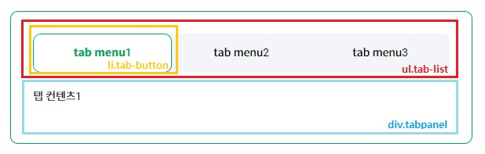

2022년 12월 28일 한국형 웹 콘텐츠 접근성 지침 2.2(KS X OT0003:2022)이 새롭게 개정되어 안내드립니다.
기존 24개의 검사 항목에 9개의 검사 항목이 추가되어, 총 33개의 검사 항목으로 변경되었습니다.


출처 : velog,  2021년 3월 17일, [https://velog.io/@kym123123/ARIA%EC%9D%98%EC%86%8D%EC%84%B1%EC%83%81%ED%83%9C%EC%97%AD%ED%95%A0%EB%B0%8F%EC%82%AC%EC%9A%A9-%EC%98%88%EC%8B%9C%EC%A3%BC%EC%9D%98%EC%82%AC%ED%95%AD](https://velog.io/@kym123123/ARIA%EC%9D%98%EC%86%8D%EC%84%B1%EC%83%81%ED%83%9C%EC%97%AD%ED%95%A0%EB%B0%8F%EC%82%AC%EC%9A%A9-%EC%98%88%EC%8B%9C%EC%A3%BC%EC%9D%98%EC%82%AC%ED%95%AD)

1. [ARIA](#aria)
2. [ARIA 사용규칙](#aria-rule)
3. [WAI-ARIA 자동완성 UI개선](#aria-ui-improvement)
4. [ARIA 사용 예시](#aria-example)
5. [참고 코드](#aria-reference)
### ARIA <a id="aria" href="#aria">#</a>

##### role(역할): 특정 요소에 역할정의, 사용자에게 정보제공, 부여한 역할 동적변경 불가

- **role="application"**<br>
:동일요소x,div요소와같이 그룹역할을하는 요소로 대체
- **role="banner"**<br>
:비슷한 의미로 `<header>`사용가능 -> `<header role="banner">` 로 사용시 1페이지에서 1개만 사용하기를 권장
- **role="navigation"**<br>
:`<nav>`와 동일
- **role="main"**<br>
:`<main>`과 동일 ->1페이지 내에 1개만 사용가능하다. 본문의 주요 컨텐츠 영역
- **role="aside"**<br>
:`<aside>`와 동일, 주요컨텐츠와 연관이 적은 의미를 가진 영역
- **role="form"**<br>
:`<form>`와 동일, 서버에 전송될 수 있는 콘텐츠, 폼관련 요소 모임
- **role="search"**<br>
:검색 역할을 담당하는 서식영역, `<div>`또는 `<form>`에 사용권장.
- **role="contentinfo"**<br>
:<`footer>`와 비슷, `<footer role="contentinfo">`로 사용시 한 페이지에 한개요소만 사용하길 권장.
- **role="button"**<br>
:p, span, div에서도 버튼컨트롤로 사용된다는 것을 스크린리더에 인식시킬 수 있다.
가능하면 button role보다 기본 html의 `<button>`, `<input type="button">`, `<input type="submit">`을 사용해야 한다. 기본html요소들은 추가 사용자 정의 없이 키보드 포커스를 지원한다.
- **role ="tablist"**<br>
:탭메뉴 등의 리스트임을 사용자에게 전달한다.
- **role="tab"**<br>
:보조기기가 탭으로 인식.
- **role="tabpanel"**<br>
:보조기기가 탭 패널로 인식
- **role="presentation", role="none"**<br>
:semantic의미를 요소와 그 자식요소로부터 제거하기 위해서 사용한다. 시각적으로 게시하는 용도의 요소에 적용. none은 최근에 나온 속성값으로 presentation과 같은역할을 한다. 호환성문제가 있을 수 있으니까 두개 다 기입해 주는것이 좋음.
- **role="group"**<br>
:라디오 버튼과 같이 여러개의 옵션 중 한가지를 선택 할 때, name속성값에 같은 값을 넣어줘서 그룹화 하더라도 스크린리더 사용자는 시각적으로 볼수있는 사용자와 달리 묶여있는 그룹이라는 것을 인식하기 어렵다. 이러한경우 role="group"를 부여하여 같은 그룹이라는 것을 인식시킨다
  ```html
  <div id="classtxt">Cabin Class</div>
  <ul role="group" aria-labelledby="classtxt">
      <li>
          <input id="economy" type="radio" value="economy" 
          checked="checked" name="cabin">
          <label for="economy">Economy Class</label>
      </li>
      <li>
          <input id="Prestige " type="radio" value="Prestige" name="cabin">
          <label for="Prestige ">Prestige Class</label>
      </li>
      <li>
          <input id="First" type="radio" value="First" name="cabin">
          <label for="First">First Class</label>
      </li>
  </ul>
  ```
[출처][https://aoa.gitbook.io/skymimo/aoa-2018/undefined/untitled-1](https://aoa.gitbook.io/skymimo/aoa-2018/undefined/untitled-1)

<br>

##### properties(속성) &states(상태) :<br> 요소가 기본적으로 가진 특징이나 상황에서 "aria-"라는 접두어를 갖는다.
**상태: 요소의 상황을 나타내므로 application 실행 중 자주 바뀐다.**<br>
**속성:상대적으로 바뀌는 정도가 드물다.**
<!-- ##### properties(속성) &states(상태) : 요소가 기본적으로 가진 특징or상황, "aria-"라는 접두어를 갖는다.<br> (상태: 요소의 상황을 나타내므로 application 실행 중 자주 바뀐다.) (속성:상대적으로 바뀌는 정도가 드물다.) -->
**1) 필수항목 속성 :**
- **aria-required**를 true로 지정하여 스크린리더사용자에게 해당 요소가 필수적으로 입력되어야 함을 전달.
  ```html
  <input type="checkout" aria-required="true">
  ```
- 추가설명 속성 : div #reference의 내용을 input의 추가설명으로 사용해준다.
  ```html
  <input type="text" aria-describedby="reference">
  <div id="reference">추가설명</div>
  ```
  ex> "아이디를 최소 8글자이상 입력하세요" 라는 정보를 전달해주기 위한 추가설명요소로 사용
- 그룹레이블 명명 : 간단한 명사로 해당 요소의 기능의 이해를 돕는다.<br>
**aria-label**로 div요소를 labelling 해준다.

**2) 속성 :**
- 확장되어 있는 상태의 탭 패널<br>
**aria-expanded**로 현재 탭 패널이 펼쳐짐(활성화)상태 라는 것을전달. (false=접힌상태)
  ```html
  <div role="tabpanel" aria-expanded="true">
  ```
- input에 입력된 값이 유효한지 판단하기 위한 것
  ```html
  <input type="text" aria-invalid="true">
  ```
  true는 오류가 발생한 상태라는 것을 전달.
- 선택된 상태의 토글버튼: pressed를 이용하여 해당 요소를 토글버튼으로 정의하여 준다. true는 누른상태, false는 누르지않은 상태, mixed는 부분적으로 눌린상태이다.
  ```html
  <button aria-pressed="true">
  ```
  true는 현재 버튼이 눌림상태라는 것을 전달한다.

---
#### ARIA 사용규칙  <a id="aria-rule" href="#aria-rule">#</a>
- **HTML5 섹션요소와 중복 사용하지 않는다**<br>
  `<nav role="navigation"> <nav>`(x) 동일한 역할을 하는 네이티브요소와의 중복마크업.
- **native요소의 의미, 기능 변경을 하지 않는다.**<br>
  `<h1 role="button">버튼</h1>` -> h1의 본래의 기능을 버리고 다른 역할(버튼)을 부여한 잘못된 케이스.<br>
  대안)
  ```html
  <h1><button>버튼</button></h1>
  ```
  ```html
  <h1><span role="button">버튼</span></h1>
  ```
- **키보드 사용성 보장**<br>
  :상호작용이 가능한 대화형 UI(사용자가 클릭 가능한 정보, 탭, drag&drop, slide, scroll등이 필요한 기능)를 span이나 div로 마크업 후, role="button"속성 부여시, 사용자가 키보드로 접근이 가능하도록 해야 한다.
  ```html
  <span role="button">버튼</span>
  ```
  위의 예시는 키보드로 포커싱이 불가하다 . 따라서 아래와 같이 설정해 주어야 한다.
  ```html
  <span role="button" tabindex="0">버튼</span>
  ```
  tabindex속성을 0 으로 설정하여 콘텐츠의 선형화 순서대로 키보드 포커싱이 진입한다. "0"보다 값이 작으면 키보드 포커스를 받지 못하도록 설정된다.<br>
  **키보드탭 접근 가능여부**
  | 태그 | 접근가능여부 |
  | :--: | :--: |
  | `<div>` | X |
  | `<span>` | X |
  | `<p>` | X |
  | `<button>` | O |
  | `<a>` | O |
  | `<input>` | O |
  버튼으로 사용하기위해서 role="button"속성 부여시 tabindex도 반드시 설정해서 접근이 가능하도록 한다.

- **aria-hidden="true"**
  - aria-hidden 사용시<br>
    : 스크린리더(보조기기)가 접근하는 것은 원치 않지만, 시각적으로 디자인을 주기 위해서 보여지게 하고 싶은경우에 사용한다.<br><br>
    반대로 눈에는 보이지 않게 하는데 보조기기 사용자가 정보에 접근 할 수 있도록 하기 위해서는 a11y-hidden을 지정해준다.

- **레이블(label) 제공**
  - 모든 대화형 UI의 경우, 반드시 label을 제공해야 한다. aria-label 또는 aria-labelledby로 label제공이 가능하다.
  ```html
  <div>
    <div id="user-name">이름</div>
    <input type="text" id="name" aria-labelledby="user-name">
  </div>
  ```
- **유효성 검사**: 의미를 가진 semantic요소와의 충돌을 방지한다.<br>
  ex) 문법오류, h1에 적절하지 않은 역할을 부여한 경우.
  ```html
  <h1 role="button">
    text
  </h1>
  ```
---
#### WAI-ARIA 자동완성 UI개선   <a id="aria-ui-improvement" href="#aria-ui-improvement">#</a>
- **aria-live**를 활용하여, 보조기기에서 읽어주지 않는 자동완성기능이나 실시간 갱신 정보를 인식하도록 한다.
- **role="dialog**를 활용하면, 마크업이 연속적이지 않아도, 바로 접근이 가능하다. layerpopup영역 이외의 다른 영역은 보조기기에서 접근하지 않아서 콘텐츠를 명확히 인식할 수 있도록 도와준다.
---
#### ARIA 사용 예시  <a id="aria-example" href="#aria-example">#</a>
- 탭메뉴에서 WAI-ARIA사용해서 구조잡기<br>
  <br>
  보조기기가 탭 목록으로 인식한다.
  ```html
  <ul class="tab__list" role="tablist">
  ```
  :보조기기가 탭으로 인식한다.
  ```html
  <li class="tab__button" role="tab">
  ```
  :보조기기가 탭 패널로 인식한다.
  ```html
  <div class="tab__pannel" role="tabpanel">
  ```
  - role="tablist" ->aria-label혹은, aria-labelledby로 제목을 붙혀야 한다.<br>
    목록제목이 별도로 없을시, aria-label="한국소설"등으로 적당하게 붙혀준다.
  - aria-controls:이 탭이 어떤 요소에 대한 컨트롤인지를 참조한다. 연관 요소의 id값을 이용.<br>
    1) div에 id="tab-panel-1"로 id를 넣어둔다<br>
    2) tab-button의 aria-controls에 tab-banel-1로 매칭시켜준다.<br>
    3) aria-labelledby(id값을 갖게 되어있음)는 tab패널과 연관된 요소에 매칭한다. id값을 가진 요소의 text content를 제목으로 사용한다.
    ```html
    <li id="tab-button-1" class="tab__button" role="tab" aria-controls="tab-panel-1">청춘예찬</li>
    ...
    <div id="tab-panel-1" class="tab__panel" role="tabpanel" aria-labelledby="tab-button-1"> 
        그들은 청춘의~~~ 피는꽃이~~ 텍스트내용
    </div>
    ```
    li와 div가 서로의 id값으로 연결되어 있음.


##### 참고  <a id="aria-reference" href="#aria-reference">#</a>

```html
<!-- 역할(roles) -->
<element role="tablist">
<element role="tab">
<element role="tabpanel">
<element role="tooltip">
<element role="status">
<element role="alert">
<element role="alertdialog">
<element role="dialog">
<element role="navigation">
<element role="complementary">
<element role="none">

<!-- 상태(states) -->
<element aria-current="page|step|location|date|time|true|false(default)">
<element aria-selected="false|true|undefined(default)">
<element aria-haspopup="true|menu|dialog|listbox|tree|grid|false(default)">
<element aria-expanded="true|false|undefined(default)">
<element aria-pressed="true|false|mixed|undefined(default)">
<element aria-hidden="true|false|undefined(default)">
<element aria-invalid="true|false(default)|grammar|spelling">

<!-- 속성(properties) -->
<element aria-controls="ID reference list">
<element aria-live="polite|assertive|off(default)">
<element aria-labelledby="ID reference list">
<element aria-label="string">
<element aria-describedby="ID reference list">
<element aria-errormessage="ID reference">
<element aria-modal="true|false(default)">
```


---
[목록으로](/)
