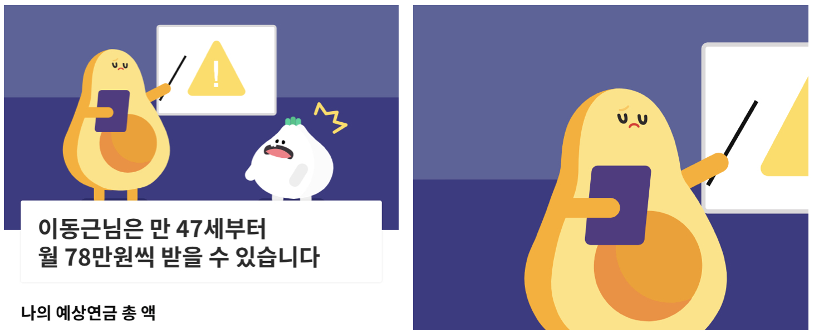
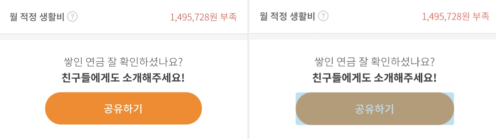
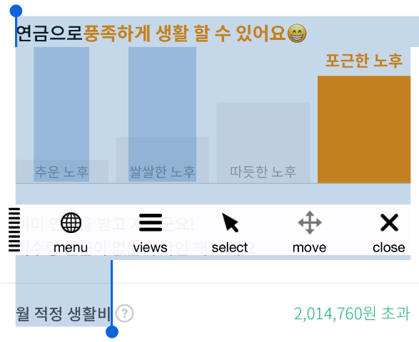
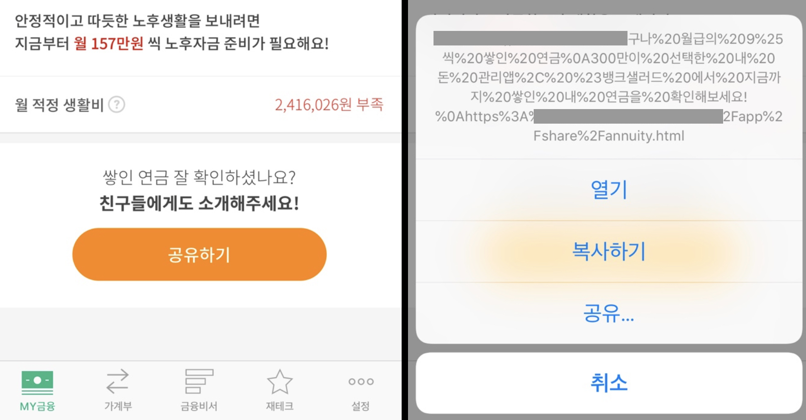

출처 : shylog,  2020년 02월 04일, [https://shylog.com/settings-for-a-more-complete-webview/](https://shylog.com/settings-for-a-more-complete-webview/)<br>

1. [WebView란](#aria)
2. [pinch to zoom](#zoom)
3. [참고 코드](#aria-reference)
### WebView <a id="aria" href="#aria">#</a>


>웹뷰(WebView)란 프레임워크에 내장된 웹 브라우저 컴포넌트로 뷰(View)의 형태로 앱에 임베딩하는 것을 말한다.즉, 앱 안에 HTML iframe을 넣어놓은 것이다.웹 페이지를 보기 위해서 혹은 앱 안에서 HTML을 호출하여 앱을 구현하는 하이브리드 형태의 애을 개발하는데에도 많이 사용된다.

##### 1.pinch to zoom & zoom-in action <a id="zoom" href="#zoom">#</a>

위 이미지의 오른쪽 처럼 webview에서 더블 클릭을 하거나 pinch to zoom을 이용해서 확대를 할 수 있다면  기본적으로 앱에서 zoom을 이용한 커뮤니케이션을 하는 경우가 많이 없기 때문에 당연히 webview에서도 막는 것이 좋다.
```html
<meta name="viewport" content="width=device-width, initial-scale=1, maximum-scale=1.0, minimum-scale=1, user-scalable=0">
```
`head` meta tag에 다음과 같이 속성을 추가해주면 된다.
- `maximum-scale=1.0` : 최대 줌인을 1배만큼 한다.
- `minimum-scale=1.0` : 최소 줌아웃을 1배만큼 한다.
- `user-scalable=0` : 유저가 pinch-to-zoom이나 double touch를 통한 zoom action을 못하게 한다.<br><br>
위 3개를 통해 zoom과 관련된 내용들을 막을 수 있다.
>참고1. width=device-width를 추가해야 제대로된 모바일 페이지를 볼 수 있다.<br>참고2. 해당 부분은 web에서도 막을 수 있지만 AND와 IOS 자체적으로 막을 수 있다.

##### 2.버튼 Touch 시 나오는 음영 지우기 <a id="zoom" href="#zoom">#</a>

webview에서 버튼을 클릭 했을 때 오른쪽 이미지와 같이 음영이 생긴다. 머터리얼 디자인처럼 각진 모양의 버튼에서는 크게 눈에 띄지 않지만 모서리가 둥근 버튼이나 텍스트로 된 a link의 경우 깔끔하지 않은 화면을 만나볼 수 있다.
```css
* {
  -webkit-tap-highlight-color:rgba(255,255,255,0);
}
```
위의 속성 때문에 선택 음영이 나오는 것인데 해당 속성에 color 값을 넣으면 자신이 의도한 색상으로 음영을 만들 수도 있다. 위 속성의 rgba(255, 255, 255, 0) 에서 중요한 포인트는 투명도를 0으로 하는 것이다. (transparent를 넣으면 투명하게 처리할 수 있으나 구형의 안드로이드에서는 정상적으로 동작 안할 수 있다.)<br><br>
위 3개를 통해 zoom과 관련된 내용들을 막을 수 있다.
>* 을 이용해서 현재 모든 Tag들에 일괄 적용 했지만 특정 부분에서만 해당 속성을 추가해서 특정 Tag에서만 동작하지 않게 할 수 있다.


##### 3.test select 안되게 하기 <a id="zoom" href="#zoom">#</a>


```css
* {
	user-select: none;
}
```
위의 `user-select` 를 이용한다면 유저가 더블클릭 등을 이용하여 글자를 선택하는 것을 막을 수 있다
`user-select: auto | all | none | text` 총 4개의 값이 존재하며 아래와 같다.

- `auto` : default 값으로 브라우저 허용 시 텍스트 선택 가능
- `all` : 더블클릭이 아닌 클릭만으로도 선택이 가능
- `none` : 텍스트 선택이 안됨
- `text` : 텍스트 선택이 가능

##### 4. link Long touch 막기 <a id="zoom" href="#zoom">#</a>

a tag 와 같은 link tag는 long touch(press) 할 경우 위와 같이 나오게 된다. 유저에게 불필요한 정보를 노출하는 것은 유저 경험 뿐만 아니라 보안적인 측면에서도 좋지 않다
```css
* {
  -webkit-touch-callout: none;
}
```
위 속성을 통해 팝업이나 액션시트를 제어할 수 있다. 아래와 같은 값들을 지정해 줄 수 있다.
```css
/* Keyword values */
-webkit-touch-callout: default;
-webkit-touch-callout: none;

/* Global values */
-webkit-touch-callout: initial;
-webkit-touch-callout: inherit;
-webkit-touch-callout: unset;
```
참고1. 해당 부분도 AND와 IOS 자체 설정으로 막을 수 있다.

---
[목록으로](/)
